# Semantics, Syntactic Proofs, and Metatheory

Handout: [Impcore expression rules](https://www.cs.tufts.edu/comp/105-2017f/handouts/impcore-exp-rules.pdf)

## Announcements
 * HW1-impcore answers posted on piazza, will be graded ASAP
 * HW2-opsem homework now available

Both math and code on homework

You’re good with code—lecture and recitation will focus on math

## Today
 * Finish up introduction to operational semantics from last Wednesday
   * Abstract machines
   * Evaluation judgement
   * Operational Semantics
   * Correspondance between code and inference rules

 * How we know what the code is supposed to do at run time: valid derivations

 * What we know about valid derivations: metatheory

## Last Time
 * Operational semantics of function application
 * Compositionality (FIXME?)
 * Abstract Syntax Trees
 * Environments: Globals (ξ), Functions (ϕ), Locals (ρ)

<hr>
<p> </p>
 
<hr>
<p>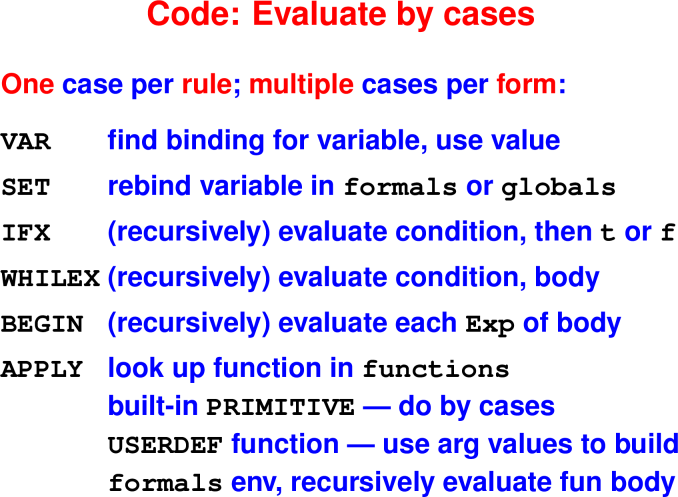 </p>

<hr>
<p> </p>
 
<hr>
<p> </p>

<hr>
<p>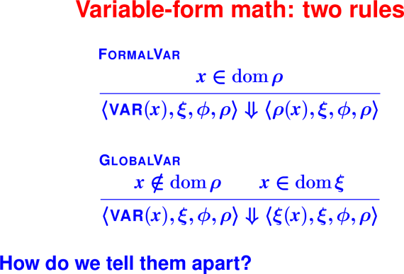 </p>

<hr>
<p>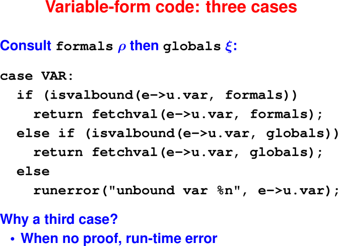 </p>

<hr>
<p>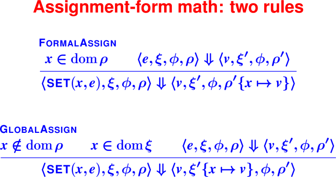 </p>

<hr>
<p>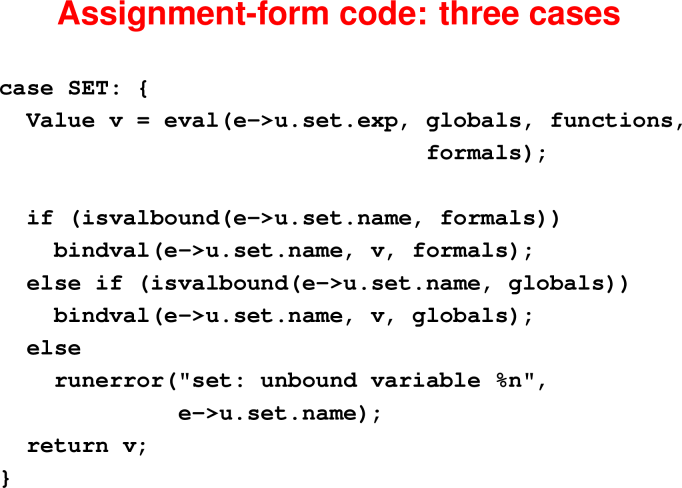 </p>

<hr>
<p>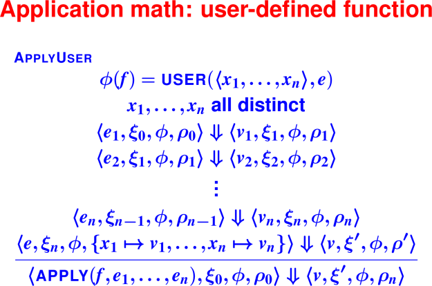 </p>

<hr>
<p> </p>
<hr>

### Questions:

 * In what order are the actual parameters evaluated?
   How can you tell?

 * What happens if the formal parameter names are duplicated?

 * How many formal parameters can the body of f access?
   What are their names?

 * Can changes to formal parameters in the body of f be seen by 
   the code calling f?

 * Can changes to globals in the body of f be seen by the code calling f?

<hr>
<p>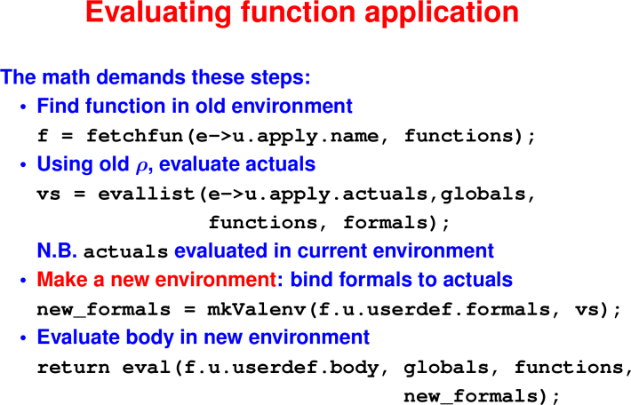 </p>
<hr>

## Using Operational Semantics

### The big idea:

Every terminating computation is described by a data structure—we're
going to turn computation into a data structure. Proofs about computations 
are hard, but proofs about data structures are lots easier.

### Valid derivations, or "How do I know what this program should evaluate to?"

Code example
```
  (define and (p q)
    (if p q 0))

  (define digit? (n)
    (and (<= 0 n) (< n 10)))
```
Suppose we evaluate `(digit? 7)`

### Exercises:

 1. In the body of digit?, what expressions are evaluated in what order?

 2. As a function application, the body matches template `(f e1 e2)`. 
    In this example,
   * What is f?
   * What is e1?
   * What is e2?

<hr>
<p>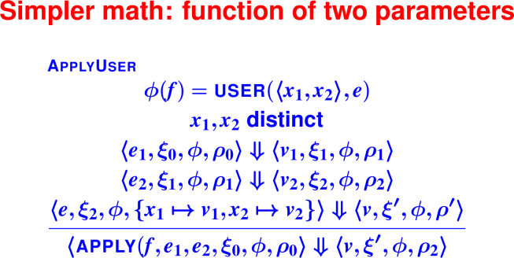 </p>
<hr>

What is the result of `(digit? 7)`?

How do we know it's right?

### From rules to proofs

What can a proof tell us?

<hr>
<p>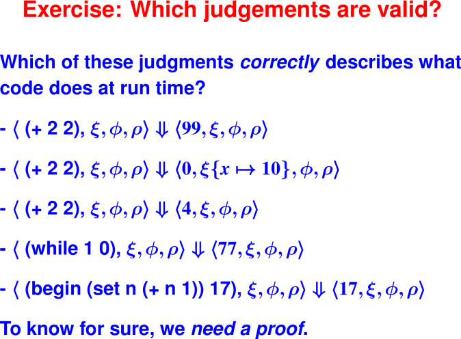 </p>
<hr>

### Judgment is valid when "derivable"

Special kind of proof: **derivation**

 * It's a data structure (derivation tree)

 * Made inductively, by composing rules

 * Valid derivation matches rules (by substitution)

 * Spacelike representation of timelike behavior (think 
   flip-book animation)

A form of "syntactic proof"

### Recursive evaluator travels inductive proof

Root of derivation at the **bottom** (surprise!)

Build

 * Start on the left, go up
 * Cross the ⇓
 * Finish on the right, go down

First let’s see a movie

### Example derivation (rules in handout)

<hr>
<p>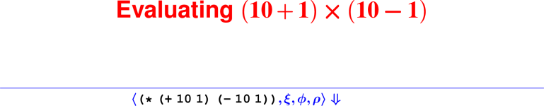 </p>

<hr>
<p>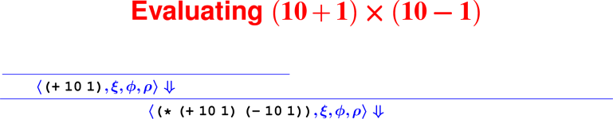 </p>

<hr>
<p>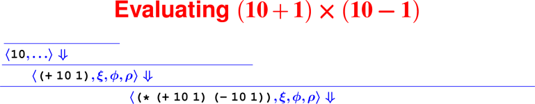 </p>

<hr>
<p>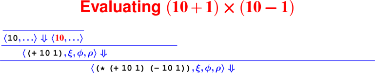 </p>

<hr>
<p>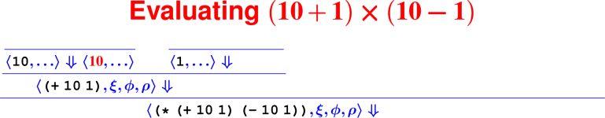 </p>

<hr>
<p>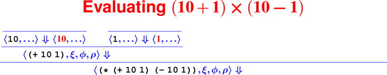 </p>

<hr>
<p>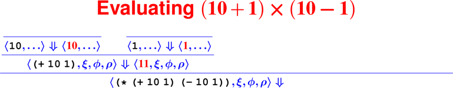 </p>

<hr>
<p>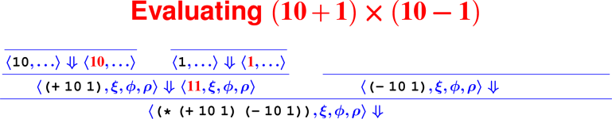 </p>

<hr>
<p>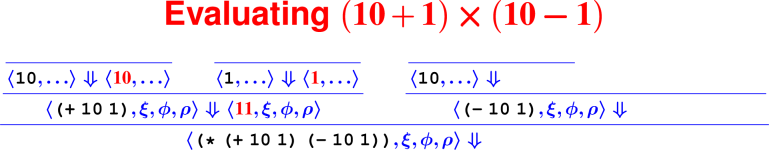 </p>

<hr>
<p> </p>

<hr>
<p>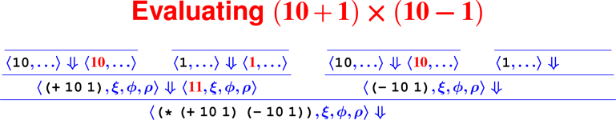 </p>

<hr>
<p>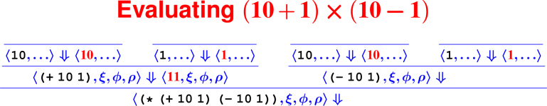 </p>

<hr>
<p>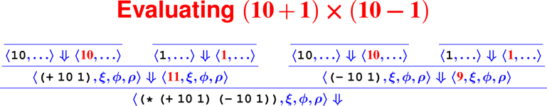 </p>

<hr>
<p>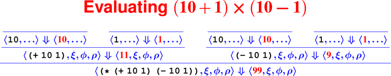 </p>

### Building derivations

<hr>
<p> </p>

<hr>
<p> </p>
<hr>


At this point, we’ve now covered derivations and how a single derivation corresponds 
to evaluating a particular program.

## Proofs about all derivations: Metatheory

### Derivations (aka syntactic proofs) enable meta-reasoning

Derivation D is a data structure

Got a fact about all derivations?

 * It's a fact about all terminating evaluations

 * They are in 1 to 1 correspondance.

Prove facts by structural induction over derivations

 * (Or “induction on height of derivation tree”)

Example: Evaluating an expression doesn't change the set of global variables

### Metatheorems often help implementors

More example metatheorems:

 * OK to mutate environments if you use a stack

 * Interactive browser doesn't leak space (POPL 2012)
 
 * Device driver can't harm kernel (Microsoft Singularity)

<hr>
<p> </p>
<hr>

### Metatheorems are proved by induction

Induction over structure (or height) of derivation trees $\mathcal D$

These are “math-class proofs” (not derivations)

Proof

 * Has one case for each rule

 * Has multiple cases for some syntactic forms

 * Assumes the induction hypothesis for any proper sub-derivation (derivation of a premise)

Let's try it!

Cases to try:

 * Literal
 * GlobalVar
 * SetGlobal
 * IfTrue
 * ApplyUser2

For your homework, “Theory Impcore” leaves out While and Begin rules.

