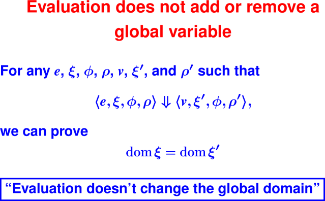
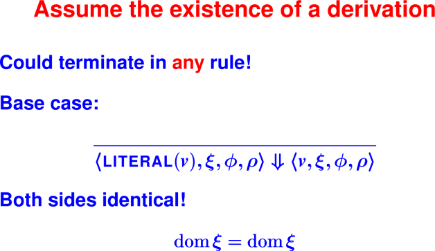
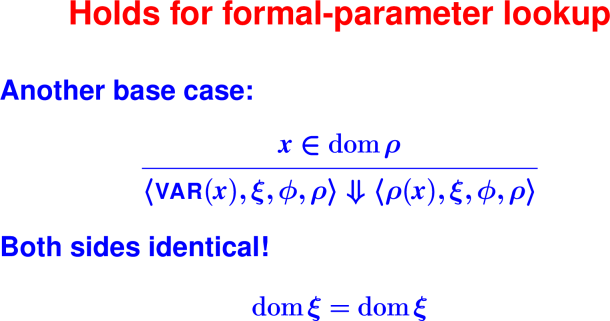
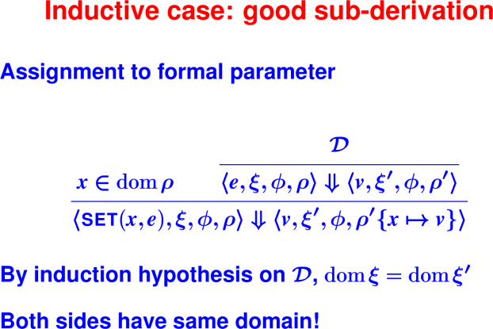
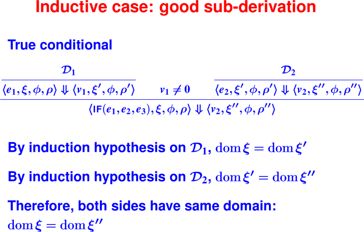
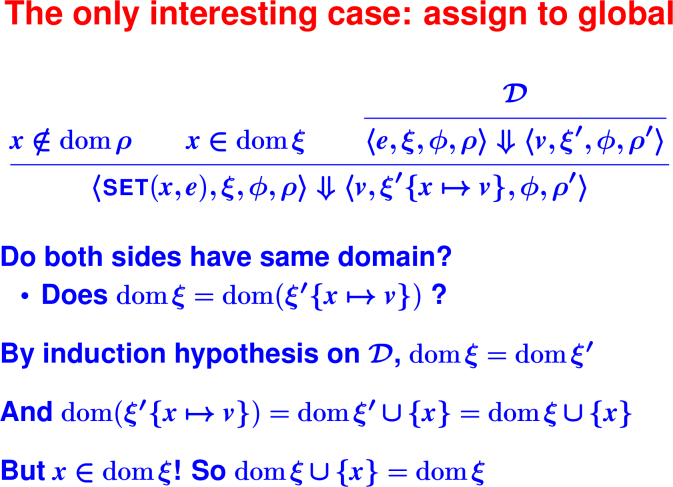
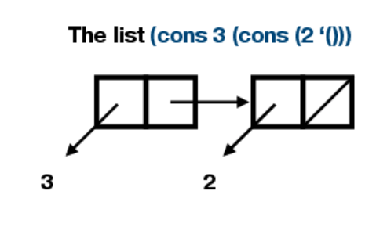

# Metatheory. Intro to functional programming.

## Today
 * Metatheory allows us to prove things about all programs in the language.

 * Induction on derivations (metatheory)
 
 * Introduction to Scheme

## Last Time

 * Operational semantics of function application

 * A valid derivation defines the execution of a single program.


<hr>
<p> </p>
<hr>
<hr>
<p> </p>
<hr>
<hr>
<p> </p>
<hr>
<hr>
<p> </p>
<hr>
<hr>
<p> </p>
<hr>
<hr>
<p> </p>
<hr>
<hr>
<p> </p>
<hr>

## Scheme

### Where are we going?

Recursion and composition:
 * Recursive functions in depth
 * Two recursive data structures: the list and the S-expression
  * More powerful ways of putting functions together (compositionality 
    again, and it leads to reuse)

#### Recursion comes from inductive structure of input

Structure of the input drives the structure of the code.

You’ll learn to use a three-step design process:

 1. Inductive structure
 2. Equations ("algebraic laws")
 3. Code

To discover recursive functions, write algebraic laws:
```
    sum 0 = 0
    sum n = n + sum (n - 1)
```
Which direction gets smaller?

Code:
```
    (define sum (n)
       (if (= n 0) 0 (+ n (sum (- n 1)))))
```
Another example:
```
    exp x 0 = 1
    exp x (n + 1) = x * (exp x n)
```
Can you find a direction in which something gets smaller?

Code:

(define exp (x m) 
  (if (= m 0) 
      1
      (* x (exp x (- m 1)))))

### For a new language, five powerful questions

As a lens for understanding, you can ask these questions about any language:

 1. **What is the abstract syntax?** What are the syntactic categories, 
    and what are the terms in each category?

 2. **What are the values?** What do expressions/terms evaluate to?

 3. **What environments are there?** That is, what can names stand for?

 4. **How are terms evaluated?** What are the judgments? What are the 
    evaluation rules?

 5. **What’s in the initial basis?** Primitives and otherwise, what is built in?

(Initial basis for μScheme on page 161)

### Introduction to Scheme

Question 2: What are the values?

Two new kinds of data:

 * The function closure: the key to "first-class" functions

 * Pointer to automatically managed cons cell

#### Graphically:

Picture of two cons cells, when cons cells are constructed as follows:
```
    (cons 3 (cons 2 ’()))
````

</p>

#### Scheme Values

Values are *S-expressions*.

An S-expression is either

 * a **symbol** 'GouldSimpson 'UofA

 * a **literal integer** 0 77

 * a **literal Boolean** #t #f

 * `(cons v1 v2)`, where `v1` and `v2` are S-expressions

Many predefined functions work with a **list of S-expressions**

A list of S-expressions is either

 * the empty list `'()`

 * `(cons v1 v2)`, where `v1` is an S-expression and `v2` is a list 
   of S-expressions

   We say "an S-expression followed by a list of S-expressions"

#### S-Expression operators

Like any other abstract data type, S-Expresions have:

 * **creators** that create new values of the type `'()`

 * **producers** that make new values from existing values `(cons s s')`

 * **mutators** that change values of the type (not in uScheme)

 * observers that examine values of the type
   `number?  symbol?  boolean?  null?  pair?  car  cdr`

N.B. creators + producers = constructors

#### Examples of S-Expression operators


 `(cons 'a '())`         also written `'(a)`

 `(cons 'b '(a))`        equals `'(b a)`

 `(cons 'c '(b a))`      equals `'(c b a)`

 `(null? '(c b a))`      equals `#f`

 `(cdr '(c b a)`         equals `'(b a)`

 `(car '(c b a)`         equals `'c`


The symbol `'` is pronounced "tick."
It indicates that what follows is a literal.

Picture of `(cons c (cons b (cons a '())))`

Your turn!
What is the representation of
```
    '((a b) (c d))
```
which can be alternatively written
```
    cons( (cons a (cons b '()))

          `(cons (cons c (cons d '())) '()))`
```
What is the representation of
```
    cons('a 'b)
```
Contrast this representation with the one for
```
    cons('a '())
```
Both of these expressions are S-expressions, but only `cons('a '())` is a list.

Picture of `'((a b) (c d))`


Picture of `cons('a 'b)`


