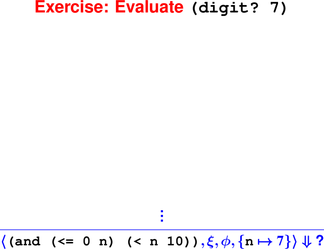
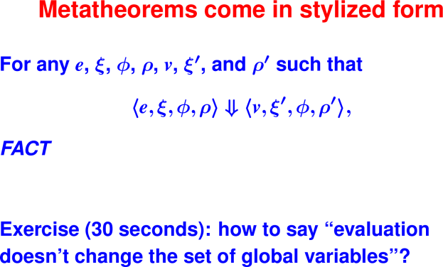

# Metatheory. Intro to functional programming.

## Today
 * Metatheory allows us to prove things about all programs in the language.

 * Induction on derivations (metatheory)
 
 * Introduction to Scheme

## Last Time

 * Operational semantics of function application

 * A valid derivation defines the execution of a single program.

### Building derivations

 

 

At this point, we’ve now covered derivations and how a single derivation corresponds 
to evaluating a particular program.

## Proofs about all derivations: Metatheory

### Derivations (aka syntactic proofs) enable meta-reasoning

Derivation D is a data structure

Got a fact about all derivations?

 * It's a fact about all terminating evaluations

 * They are in 1 to 1 correspondance.

Prove facts by structural induction over derivations

 * (Or “induction on height of derivation tree”)

Example: Evaluating an expression doesn't change the set of global variables

### Metatheorems often help implementors

More example metatheorems:

 * OK to mutate environments if you use a stack

 * Interactive browser doesn't leak space (POPL 2012)
 
 * Device driver can't harm kernel (Microsoft Singularity)

 

### Metatheorems are proved by induction

Induction over structure (or height) of derivation trees $\mathcal D$

These are “math-class proofs” (not derivations)

Proof

 * Has one case for each rule

 * Has multiple cases for some syntactic forms

 * Assumes the induction hypothesis for any proper sub-derivation (derivation of a premise)

Let's try it!

Cases to try:

 * Literal
 * GlobalVar
 * SetGlobal
 * IfTrue
 * ApplyUser2

For your homework, “Theory Impcore” leaves out While and Begin rules.

 

 

 

 

 

 

## Practice writing operational semantics

Impcore can be extended with new syntactic forms for short-circuit conditionals.

 * To evaluate expression `(&& e_1 e_2)`, first evaluate `e_1`.

   * If the result of evaluating `e_1` is nonzero, evalute `e_2`, and the result of
     evaluating `e_2` is the result of evaluating the entire `&&` expression.

   * If the result of evaluating `e_1` is zero, then `e_2` is not evaluated, and the
     result of evaluating the entire `&&` expression is zero.

   * The evaluation of short-circuit `(|| e_1 e_2 )` is similar: `e_2` is evaluated 
     only if necessary.

Write as many rules as needed to specify the behavior of short-circuit `&&`.
If you want further practice, you can also write rules for short-circuit `||`.

## Metatheory exercises from book

15. Use the operational semantics to show that there exist environments 
ξ, φ, ρ, ξ′, and ρ′ and a value v1 such that

⟨if(var(x),var(x),literal(0)),ξ,φ,ρ⟩ ⇓ ⟨v1,ξ′,φ,ρ′⟩

if and only if there exist environments ξ, φ, ρ, ξ′′, and ρ′′ and a value v2 such that

⟨var(x),ξ,φ,ρ⟩ ⇓ ⟨v2,ξ′′,φ,ρ′′⟩.

Give necessary and sufficient conditions on the environments ξ, φ, and ρ such that
both expressions evaluate successfully.

16. Prove that the value of a while expression is always zero. That is, given any 
ξ, φ, ρ, e1, and e2, prove that if there exist a ξ′, ρ′, and v such that there is a 
derivation of ⟨while(e1, e2), ξ, φ, ρ⟩ ⇓ ⟨v, ξ′, φ, ρ′⟩, then v = 0.
Use structural induction on the derivation.

