## Scheme (February 3 and 5, 2020)

### Where are we going?

Recursion and composition:
 * Recursive functions in depth
 * Two recursive data structures: the list and the S-expression
 * More powerful ways of putting functions together (compositionality 
   again, and it leads to reuse)

#### Recursion comes from inductive structure of input

Structure of the input drives the structure of the code.

You’ll learn to use a three-step design process:

 1. Inductive structure
 2. Equations ("algebraic laws")
 3. Code

To discover recursive functions, write algebraic laws:
```
    sum 0 = 0
    sum n = n + sum (n - 1)
```
Which direction gets smaller?

Code:
```
    (define sum (n)
       (if (= n 0) 0 (+ n (sum (- n 1)))))
```
Another example:
```
    exp x 0 = 1
    exp x (n + 1) = x * (exp x n)
```
Can you find a direction in which something gets smaller?

Code:

(define exp (x m) 
  (if (= m 0) 
      1
      (* x (exp x (- m 1)))))

### For a new language, five powerful questions

As a lens for understanding, you can ask these questions about any language:

 1. **What is the abstract syntax?** What are the syntactic categories, 
    and what are the terms in each category?

 2. **What are the values?** What do expressions/terms evaluate to?

 3. **What environments are there?** That is, what can names stand for?

 4. **How are terms evaluated?** What are the judgments? What are the 
    evaluation rules?

 5. **What’s in the initial basis?** Primitives and otherwise, what is built in?

(Initial basis for μScheme on page 161)

### Introduction to Scheme

Question 2: What are the values?

Two new kinds of data:

 * The function closure: the key to "first-class" functions

 * Pointer to automatically managed cons cell

#### Graphically:

Picture of two cons cells, when cons cells are constructed as follows:
```
    (cons 3 (cons 2 ’()))
````

</p>

#### Scheme Values

Values are *S-expressions*.

An S-expression is either

 * a **symbol** 'GouldSimpson 'UofA

 * a **literal integer** 0 77

 * a **literal Boolean** #t #f

 * `(cons v1 v2)`, where `v1` and `v2` are S-expressions

Many predefined functions work with a **list of S-expressions**

A list of S-expressions is either

 * the empty list `'()`

 * `(cons v1 v2)`, where `v1` is an S-expression and `v2` is a list 
   of S-expressions

   We say "an S-expression followed by a list of S-expressions"

#### S-Expression operators

Like any other abstract data type, S-Expresions have:

 * **creators** that create new values of the type `'()`

 * **producers** that make new values from existing values `(cons s s')`

 * **mutators** that change values of the type (not in uScheme)

 * observers that examine values of the type
   `number?  symbol?  boolean?  null?  pair?  car  cdr`

N.B. creators + producers = constructors

#### Examples of S-Expression operators


 `(cons 'a '())`         also written `'(a)`

 `(cons 'b '(a))`        equals `'(b a)`

 `(cons 'c '(b a))`      equals `'(c b a)`

 `(null? '(c b a))`      equals `#f`

 `(cdr '(c b a)`         equals `'(b a)`

 `(car '(c b a)`         equals `'c`


The symbol `'` is pronounced "tick."
It indicates that what follows is a literal.

Picture of `(cons c (cons b (cons a '())))`
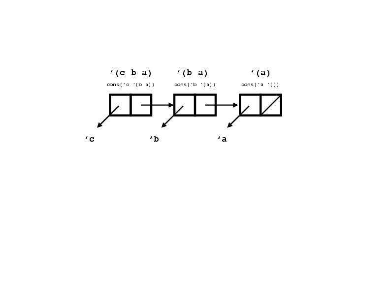
</p>

### Your turn!

What is the representation of
```
    '((a b) (c d))
```
which can be alternatively written
```
    cons( (cons a (cons b '()))

          (cons (cons c (cons d '())) '()))
```
What is the representation of
```
    cons('a 'b)
```
Contrast this representation with the one for
```
    cons('a '())
```
Both of these expressions are S-expressions, but only `cons('a '())` is a list.


Picture of `'((a b) (c d))`
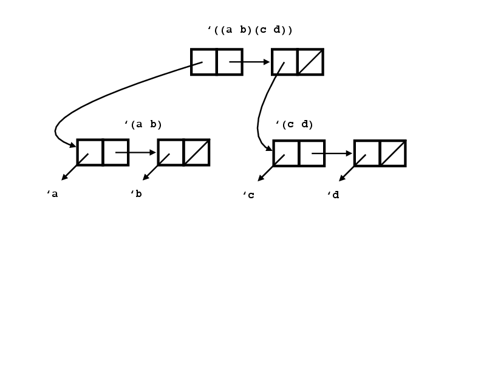
</p>


Picture of `cons('a 'b)`
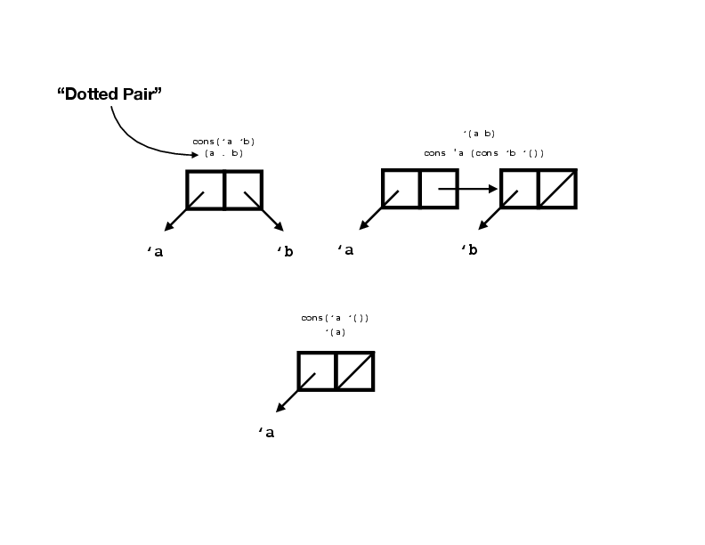
</p>


# Next

 * Lists

 * Algebraic Laws for writing functions

 * The cons cost model

 * The method of accumulating parameters

## Lists

### Subset of S-Expressions.

Can be defined via a recursion equation or by inference rules:

<hr>
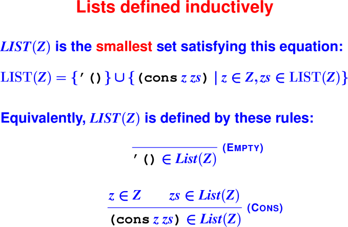
<hr>

**Constructors:* `'(),cons`

***Observers:** `null?`, `pair?`, `car`, `cdr` (also known as first and rest, head and tail, and many other names)

### Why are lists useful?

 * Sequences a frequently used abstraction

 * Can easily approximate a set

 * Can implement finite maps with association lists (aka dictionaries)

 * You don't have to manage memory

These "cheap and cheerful" representations are less efficient than balanced 
search trees, but are very easy to implement and work with—see the book.

The only thing new here is automatic memory management. Everything else you 
could do in C. (You can have 
[automatic memory management in C as well](https://www.hboehm.info/gc/).)


### Immutable data structures

Key idea of functional programming. Instead of mutating, build a new one. 
Supports composition, backtracking, parallelism, shared state.

### Review: Algebraic laws of lists

You fill in these right-hand sides:
```
    (null? '()) == 
    (null? (cons v vs)) == 
    (car (cons v vs)) == 
    (cdr (cons v vs)) == 

    (length '()) ==
    (length (cons v vs)) ==
```    
Combine creators/producers with observers to create laws.

Can use laws to prove properties of code and to write better code.

### Recursive functions for recursive types

Any list is therefore constructed with '() or with cons applied 
to an atom and a smaller list.

 * How can you tell the difference between these types of lists?

 * What, therefore, is the structure of a function that consumes a list?

Example: `length`

Algebraic Laws for `length`

Code:
```
    ;; you fill in this part

```

### Algebraic laws to design list functions, or List-design shortcuts (Feb 5)

Three forms of "followed by"

 * **Given:** Element .. list of values = `(cons x xs)`

 * **Define:** List of values .. list of values = `(append xs ys)`

 * **Ignore:** List of values .. element = `(snoc xs y)`
   Or `(append xs (list1 y))`

Two lists (xs and ys)? Four cases!
Using informal math notation with .. for "followed by" and e for the 
empty sequence, y and z for an element, and xs, ys, and zs as lists,
we have these cases:

```
    xs .. ys, where ys is empty sequence
    xs .. ys, where xs is empty sequence
    (z .. zs) .. ys, where xs=(z .. zs) and looking at the first element in xs
    xs .. (v .. vs), where ys=(v .. vs) and looking at the first element in ys
```

Some algebraic laws for append:
```
    xs .. e         = xs
    e .. ys         = ys
    (z .. zs) .. ys = z .. (zs .. ys)  ;; subsumes the first case
    xs .. (v .. vs) = (xs .. v) .. vs  ;; this would require snoc, so remove
```


### Example: Append

 * Which rules look useful for writing append?

   You fill in these right-hand sides:
```
    (append '()         ys) == 

    (append (cons z zs) ys) == 
```

 * Which one of the algebraic rules are missing?  Why?


### Equations and function for append
```
    (append '()         ys) == ys

    (append (cons z zs) ys) == (cons z (append zs ys))


    (define append (xs ys)

      (if (null? xs)

          ys

          (cons (car xs) (append (cdr xs) ys))))
```
Why does it terminate?


### Cost model

The major cost center is `cons` because it corresponds to **allocation**.

How many cons cells are allocated?

Let’s rigorously explore the cost of append.

### Induction Principle for List(Z)

Suppose I can prove two things:

 1. IH (’())

 2. Whenever z in Z and also IH(zs), then IH (cons z zs)

then I can conclude

Forall zs in List(Z), IH(zs)

### Example: The cost of append

*Claim*: Cost (append xs ys) = (length xs)

*Proof*: By induction on the structure of xs.

Base case: xs = ’()

 * I am not allowed to make any assumptions.
```
    (append '() ys)
    = { substitute implementation of append }
    (if (null? xs) ys (cons (car xs) (append (cdr xs) ys)))
    = { because of algebraic law (null? '()) = #t }
    (if #t ys (cons (car xs) (append (cdr xs) ys)))
    = { because of algebraic law (if #t a b) = a }
    ys
```
   Nothing has been allocated, so the cost is zero.

   (length xs) is also zero.  We have an algebraic law for that.

   Therefore, cost = (length xs).

Inductive case: xs = (cons z zs)

 * I am allowed to assume the inductive hypothesis for zs.

   Therefore, I may assume the number of cons cells allocated 
   by (append zs ys) equals (length zs)

   Now, the code:
```
    (append (cons z zs) ys)
      = { because first argument is not null, this is leaving out some steps, which ones? }
      = { because (car xs) = z }
      = { because (cdr xs) = zs }
    (cons z (append zs ys))
```
The number of cons cells allocated is 1 + the number of cells allocated by (append zs ys).
```
    cost of (append xs ys)
     = { reading the code }
    1 + cost of (append zs ys)
     = { induction hypothesis }
    1 + (length zs)
     = { algebraic law for length }
    (length (cons z zs))
     = { definition of xs }
    (length xs)
```
Conclusion: Cost of append is linear in length of first argument.

### Example: list reversal

Algebraic laws for list reversal:
```
    reverse '() = '()
    reverse (x .. xs) = reverse xs .. reverse '(x) = reverse xs .. '(x)
```
And the code?

### Naive list reversal
```
    (define reverse (xs)
       (if (null? xs)
           '()
           (append (reverse (cdr xs))
                   (list1 (car xs)))))
```
The list1 function maps an atom x to the singleton list containing x.

How many cons cells are allocated? Let’s let n = |xs|.

 * Q: How many calls to reverse? A: n
 * Q: How many calls to append? A: n
 * Q: How long a list is passed to reverse? A: n-1, n-2, … , 0
 * Q: How long a list is passed as first argument to append? A: n-1, n-2, … , 0
 * Q: How many cons cells are allocated by call to list1? A: one per call to reverse.
 * Conclusion: O(n^2) cons cells allocated. (We could prove it by induction.)

## The method of accumulating parameters

The function `revapp` takes two list arguments `xs` and `ys`.
It reverses `xs` and appends the result to `ys`:
```
    (revapp xs ys) = (append (reverse xs) ys)
```
Write algebraic laws for `revapp` involving different possible forms for `xs`.

**Who could write the code?**

### Reversal by accumulating parameters
```
    (define revapp (xs ys)
       (if (null? xs)
           ys
           (revapp (cdr xs) 
                   (cons (car xs) ys))))

    (define reverse (xs) (revapp xs '()))
```
The cost of this version is linear in the length of the list being reversed.

Parameter `ys` is the **accumulating parameter**.
(A powerful, general technique.)

### Linear reverse, graphically

We call `reverse` on the list `'(1 2 3)`:

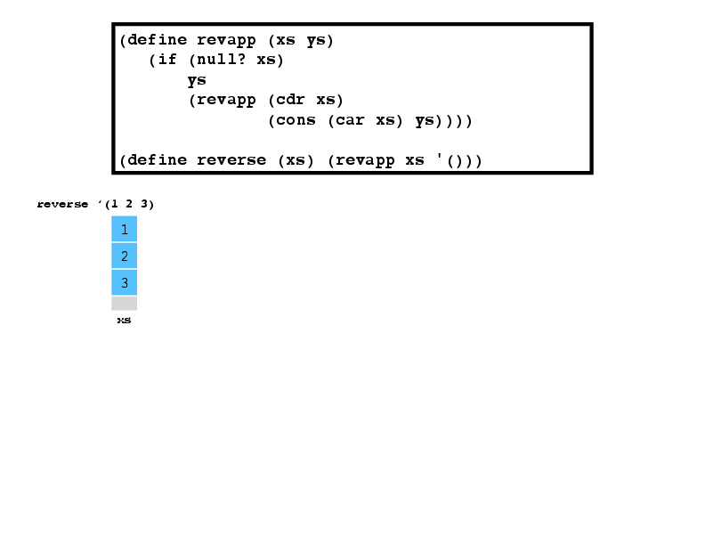

Function reverse calls the helper function revapp with 
`'()` as the `ys` argument:

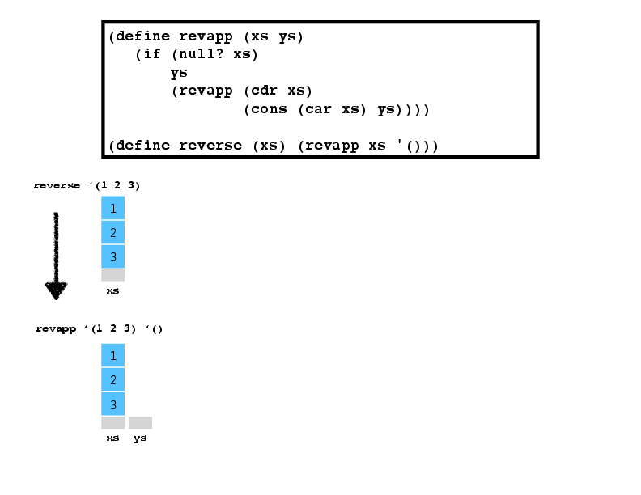


The `xs` parameter isn't `'()`, so we recursively call revapp 
with the `cdr` of `xs` and the result of consing the `car` of `xs` onto `ys`:

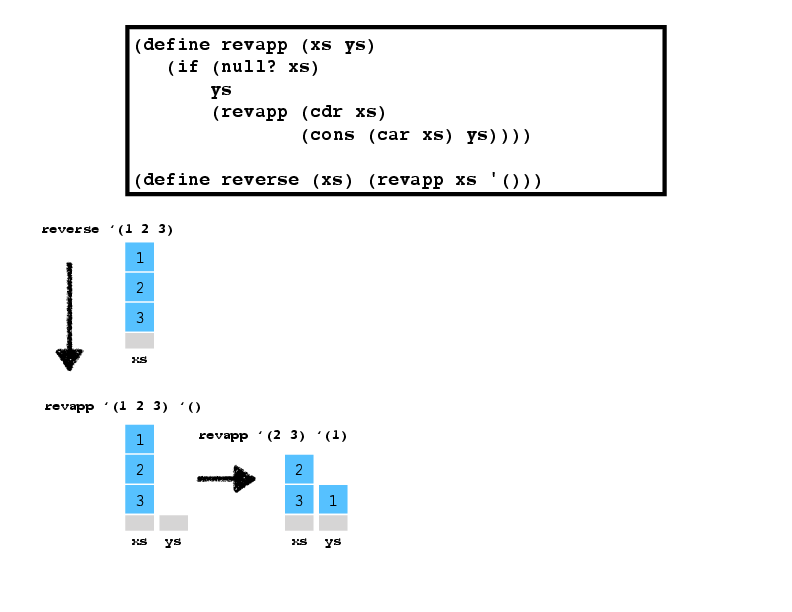


The `xs` parameter still isn't `'()`, so we again call revapp recursively:

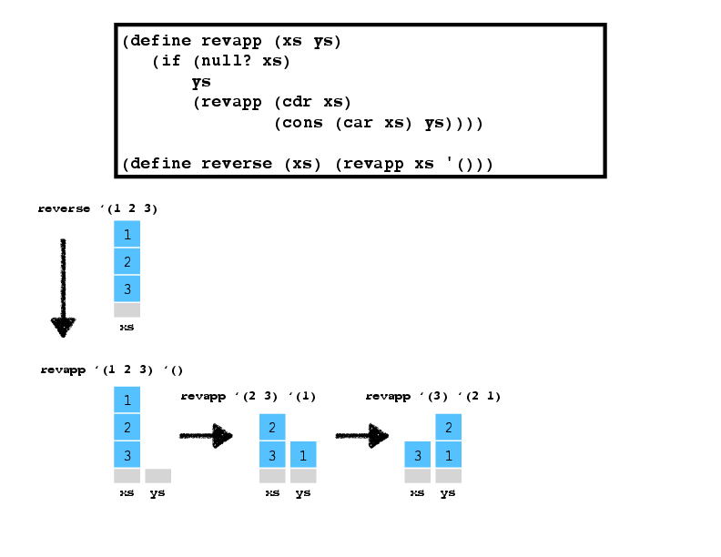

Still not `'()`, so we recurse again:

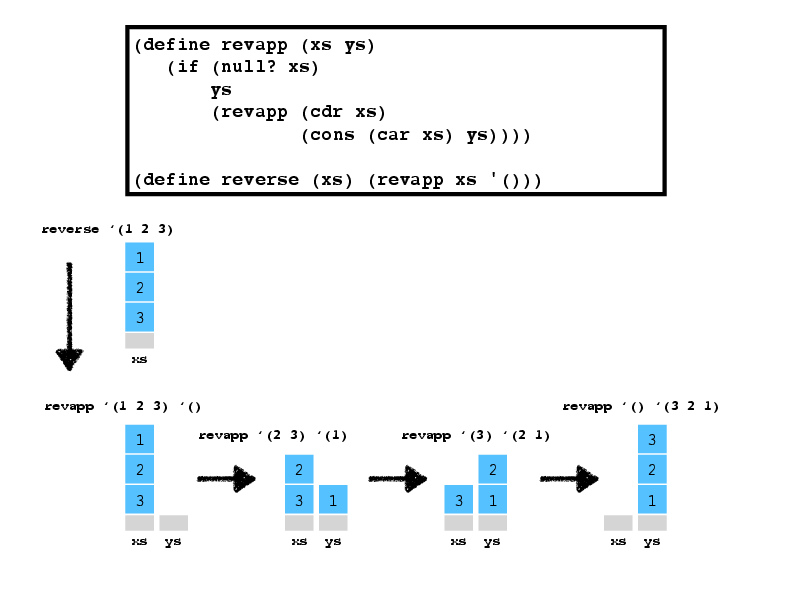


This time `xs` is `'()`, so now we just return `ys`, which now contains the original list, reversed!


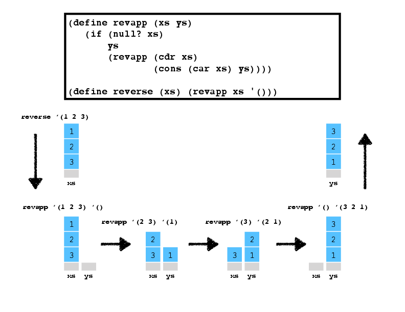


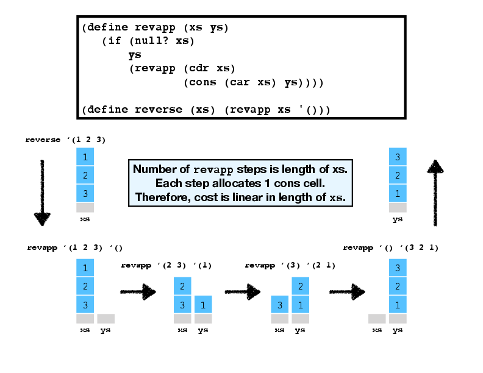
