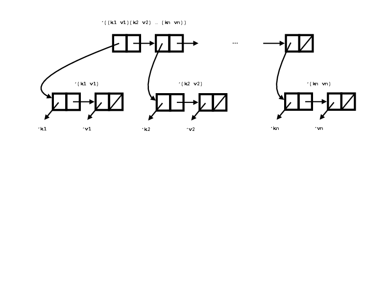
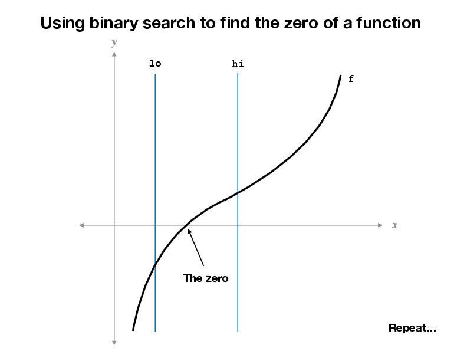
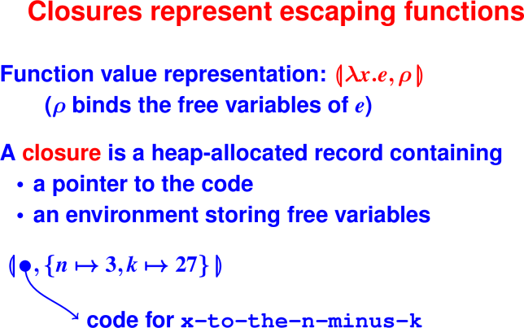
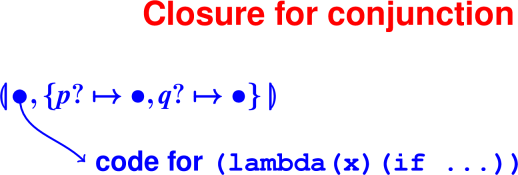
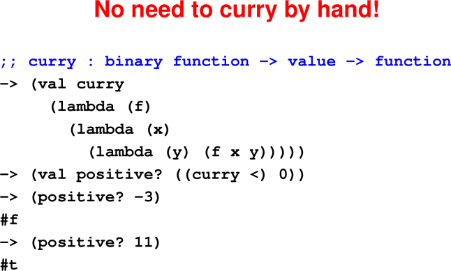

# Let and Lambda

February 10 and 12, 2020

## Announcements

* Project proposals due Friday.  See syllabus and project.md for information.
* Dr. Ravi Sethi teaching lambda calculus on Monday Feb 17th.


## Last Time
 * Inductive definitions: List of Z
 * List functions `('(), cons, car, cdr, null?)`
 * Cost model: number of cons allocations
 * Accumulating parameters: revapp

## Today and Wednesday

 * Project example
 * Association lists [Not covered in class]
 * Let construct
 * Anonymous functions

## Association lists represent finite maps [Not covered in class]

Implementation: List of key-value pairs
```
    '((k1 v1) (k2 v2) ... (kn vn))
```

Picture with spine of cons cells.


</p>

Functions `car`, `cdar`, `caar`, `cadar` can help navigate.

 * `car`: Contents of the address register

 * `caar`: Contents of the address then address register

 * `cdar`: Contents of the address then data register

 * `cadar`: Contents of the address then data then address registers

Recall that the left box in a `cons` cell is the address and the 
right box is the data. Read the a as "address" and the d as "data" 
from right to left.

In association lists, these operations correspond to

 * `car`: First key value pair, e.g., `'(k1 v1)`

 * `caar`: Key of first key value pair, e.g. `'k1`

 * `cdar`: List of values of first key value pair, e.g. `'(v1)`

 * `cadar`: Contents of the address then data then address registers, e.g. `'v1`


### A-list example
```
    -> (find 'Building 
             '((Course 520) (Building Gould-Simpson) 
               (Instructor Strout)))
    Gould-Simpson
    -> (val mms (bind 'Office 'GS-707
                (bind 'Courses '(520)
                (bind 'Email 'mstrout '()))))
    ((Email mstrout) 
     (Courses (520)) 
     (Office GS-707))
    -> (find 'Office mms) 
    GS-707
    -> (find 'Favorite-food mms)
    ()
```
Notes:

* An attribute can be a list or any other value.
* '() stands for "not found"

### Algebraic laws of association lists

Laws of assocation lists
```
    (find k (bind k v l)) = v

    (find k (bind k' v l)) = (find k l), provided k != k'

    (find k '()) =  '() --- bogus!
```

## Handy new feature of Scheme: let binding

### To Introduce local names into environment
```
    (let ((x1 e1)
          ...
          (xn en))
        e)
```
Evaluate e1 through en, bind answers to x1, … xn
 * Name intermediate results (simpler code, less error prone)
 * Creates new environment for local use only:
   ```
    rho {x1 |-> v1, ..., xn |-> vn}
   ```
Also let* (one at a time) and letrec (local recursive functions)

Note that **we have definititions in the language** and it might be 
easier to read if McCarthy had actually used definition syntax, 
which you'll see in ML, Haskell, and other functional languages:

### Syntax McCarthy should have used
```
    (let ((val x1 e1)
          ...
          (val xn en))
       e)
```

### From Impcore to uScheme

Things that should bother you about Impcore:

 * Looking up a function and looking up a variable 
   require different interfaces! (isvalbound and isfunbound)

 * To get a variable, must check 2 or 3 environments (ξ, ϕ, ρ),

 * Can't create a function without giving it a name:
   * High cognitive overhead
   * A sign of second-class citizenship
All these problems have one solution: Lambda! (λ)

### Anonymous, first-class functions

From Church’s lambda-calculus:
```
    (lambda (x) (+ x x))
```
"The function that maps x to x plus x"

At top level, like `define`. (Or more accurately, `define` is a 
synonym for lambda that also gives the lambda a name.)

In general, `\x.E` or `(lambda (x) E)`
 * `x` is bound in `E`
 * other variables are free in `E`
The ability to "capture" free variables is what makes it interesting.

**Functions become just like any other value.**

### First-class, nested functions
```
    (lambda (x) (+ x y))  ; means what??
```
What matters is that `y` can be a parameter or a let-bound variable 
of an enclosing function.
 * Can tell at compile time what is captured.
 * To understand why anyone cares, you'll need examples


**First example**: Finding roots. Given n and k, find an x such that x^n = k.

*Step 1*: Write a function that computes x^n - k.

*Step 2*: Write a function that finds a zero between lo and hi bounds.

Picture of zero-finding function. 

</p>

Algorithm uses binary search over integer interval between lo and hi. 
Finds point in that interval in which function is closest to zero.

Code that computes the function x^n - k given n and k:

### Function escapes!
```
-> (define to-the-n-minus-k (n k)
      (let
        ((x-to-the-n-minus-k (lambda (x) 
                                (- (exp x n) k))))
        x-to-the-n-minus-k))
-> (val x-cubed-minus-27 (to-the-n-minus-k 3 27))
-> (x-cubed-minus-27 2)
-19
```

The function to-the-n-minus-k is a higher-order function because it returns 
another (escaping) function as a result.

### No need to name the escaping function
```
-> (define to-the-n-minus-k (n k)
      (lambda (x) (- (exp x n) k)))

-> (val x-cubed-minus-27 (to-the-n-minus-k 3 27))
-> (x-cubed-minus-27 2)
-19
```
General purpose zero-finder that works for any function f:

### The zero-finder
```
(define findzero-between (f lo hi)
   ; binary search
   (if (>= (+ lo 1) hi)
       hi
       (let ((mid (/ (+ lo hi) 2)))
          (if (< (f mid) 0)
              (findzero-between f mid hi)
              (findzero-between f lo mid)))))
(define findzero (f) (findzero-between f 0 100))
```
`findzero-between` is also a higher-order function because it takes another 
function as an argument. But nothing escapes; you can do this in C.

Example uses:

### Cube root of 27 and square root of 16
```
-> (findzero (to-the-n-minus-k 3 27))                                    
3
-> (findzero (to-the-n-minus-k 2 16))
4
```

Your turn!!

### Lambda questions
```
(define combine (p? q?)
   (lambda (x) (if (p? x) (q? x) #f)))

(define divvy (p? q?)
   (lambda (x) (if (p? x) #t (q? x))))

(val c-p-e (combine prime? even?))
(val d-p-o (divvy   prime? odd?))

(c-p-e 9) == ?            (d-p-o 9) == ?
(c-p-e 8) == ?            (d-p-o 8) == ?
(c-p-e 7) == ?            (d-p-o 7) == ?
```
FIXME: for slides, f, f, f, t, f, t


### Escaping functions
"Escape" means "outlive the function in which the lambda was evaluated."

 * Typically returned

 * More rarely, stored in a global variable or a heap-allocated data structure

We have already seen an example:

### An "escaping" function
```
-> (define to-the-n-minus-k (n k)
      (lambda (x) (- (exp x n) k)))
```
Where are n and k stored???


 * Values that escape have to be allocated on the heap

   * C programmers use malloc to explicitly manage such values.

   * In a language with first-class, nested functions, storage of 
     escaping values is part of the semantics of lambda.

=> Draw a picture of activation record for to-the-n-minus-k with n and 
   k being popped.


<hr>

<hr>
 

An example:

### What’s the closure for conjunction?
```
(define combine (p? q?)
   (lambda (x) (if (p? x) (q? x) #f)))
```

Slide 14 
<hr>

<hr>

### Higher-order functions!

Preview: in math, what is the following equal to?
```
    (f o g)(x) == ???
```
Another algebraic law, another function:
```
    (f o g) (x) = f(g(x))
    (f o g) = \x. (f (g (x)))
```

### Functions create new functions
```
-> (define o (f g) (lambda (x) (f (g x))))
-> (define even? (n) (= 0 (mod n 2)))
-> (val odd? (o not even?))
-> (odd? 3)
#t
-> (odd? 4)
#f
```

Another example: `(o not null?)`

### Currying

*Currying* converts a binary function f(x,y) to a function f' that takes x 
and returns a function f'' that takes y and returns the value f(x,y).

As we study higher-order functions in more detail,
you will see why currying is useful.

### Classic functional technique: Currying
```
-> (val positive? (lambda (y) (< 0 y)))
-> (positive? 3)
#t
-> (val <-c (lambda (x) (lambda (y) (< x y))))
-> (val positive? (<-c 0)) ; "partial application"
-> (positive? 0)
#f
```
Curried functions take their arguments "one-at-a-time."

### What’s the algebraic law for curry?

```
     ...   (curry f) ...    =  ... f ...

     Keep in mind: 
     All you can do with a function is apply it!


     (((curry f) x) y) = f (x, y)
```

<hr>

<hr>

Your turn!!

### Exercises
```
-> (map     ((curry +) 3) '(1 2 3 4 5))
???
-> (exists? ((curry =) 3) '(1 2 3 4 5))
???
-> (filter  ((curry >) 3) '(1 2 3 4 5))
???                        ; tricky
```
FIXME put Answers in slides notes

### Bonus content: vulnerable variables?

```
-> (val seed 1)
-> (val rand (lambda ()
      (set seed (mod (+ (* seed 9) 5) 1024)))))
-> (rand)
14
-> (rand)
131
-> (set seed 1)
1
-> (rand)
14
```
Q: What’s the problem with this approach?

A: The seed is exposed to the end user, who can break the abstraction of the rand function.

### Bonus: Lambda as abstraction barrier!
```
-> (val mk-rand (lambda (seed)
     (lambda ()
       (set seed (mod (+ (* seed 9) 5) 1024))))))
-> (val rand (mk-rand 1))
-> (rand)
14
-> (rand)
131
-> (set seed 1)
error: set unbound variable seed
-> (rand)
160
```
