# High-Order Functions

February 24 and 26, 2020

## Announcements

* HW4 due Friday.
* HW5 will be posted by Friday.
* HW10 posting has been held up due to mlton compilation issues.


## Last Time
 * Closures

## Today

 * Closures to create "private" variables
 * High order function curry
 * Reasoning about Functions
 * Useful Higher-Order Functions
 * Tail Calls [not covered in class]

## Reasoning about code

### Reasoning principle for lists

Recursive function that consumes A has the same structure as a proof about A

 * Q: How to prove two lists are equal?

 * A: Prove they are both '() or that they are both cons cells cons-ing 
   equal car’s to equal cdr’s

### Reasoning principle for functions

 * Q: Can you do case analysis on a function?
 * A: No!

 * Q: So what can you do then?
 * A: Apply it!
   * Q: How to prove two functions equal?
   * A: Prove that when applied to equal arguments they produce equal results.

## Higher-Order Functions

Goal: Start with functions on *elements*, end up with functions on lists
 * Generalizes to sets, 
 * arrays, 
 * search trees, 
 * hash tables, ...


Goal: Capture common **patterns of computation** or **algorithms**
 * `exists?` (Ex: Is there a number?)
 * `all?` (Ex: Is everything a number?)
 * `filter` (Ex: Take only the numbers)
 * `map` (Ex: Add 1 to every element)
 * `foldr` (General: can do all of the above.)

Fold also called `reduce`, `accum`, or a "catamorphism"

### List search: exists?

Algorithm encapsulated: linear search

Example: Is there a even element in the list?

Algebraic laws:
```
    (exists? p? '())          == ???
    (exixts? p? '(cons a as)) == ???


    (exists? p? '())          == #f
    (exists? p? '(cons a as)) == p? x or exists? p? xs
```

Defining exists?
```
-> (define exists? (p? xs)
      (if (null? xs)
          #f
          (or (p? (car xs)) 
              (exists? p? (cdr xs)))))
-> (exists? even? '(1 3))
#f
-> (exists? even? '(1 2 3))
#t
-> (exists? ((curry =) 0) '(1 2 3))
#f
-> (exists? ((curry =) 0) '(0 1 2 3))
#t
```

### List checking: `all?`

Does everything match?  Algorithm: linear checking

Example: Is every element in a list even?

Algebraic laws:
```
    (all? p? '())          == ???
    (all? p? '(cons a as)) == ???


    (all? p? '())          == #t
    (all? p? (cons a as)) == p? x and all? p? xs
```

Defining all?
```
-> (define all? (p? xs)
      (if (null? xs)
          #t
          (and (p? (car xs)) 
               (all? p? (cdr xs)))))

-> (all? even? '(1 3)) 
#f
-> (all? even? '(2)) 
#t
-> (all? ((curry =) 0) '(1 2 3))
#f
-> (all? ((curry =) 0) '(0 0 0))
#t
```

### List selection: filter

Algorithm encapsulated: Linear filtering

Example: Given a list of numbers, return only the even ones.

Algebraic laws:
```
    (filter p? '())          == ???
    (filter p? (cons m ms)) == ???

    (filter p? '())          == '()
    (filter p? (cons m ms)) == if (p? m)
                                   (cons m (filter p? ms)) 
                                   (filter p? ms)
```

Defining filter
```
-> (define filter (p? xs)
     (if (null? xs)
       '()
       (if (p? (car xs))
         (cons (car xs) (filter p? (cdr xs)))
         (filter p? (cdr xs)))))
-> (filter (lambda (n) (>  n 0)) '(1 2 -3 -4 5 6))
(1 2 5 6)
-> (filter (lambda (n) (<= n 0)) '(1 2 -3 -4 5 6))
(-3 -4)
-> (filter ((curry <)  0) '(1 2 -3 -4 5 6))
(1 2 5 6)
-> (filter ((curry >=) 0) '(1 2 -3 -4 5 6))
(-3 -4)
```

Composition Revisited: List Filtering
```
-> (val positive? ((curry <) 0))

-> (filter positive?         '(1 2 -3 -4 5 6))
(1 2 5 6)
-> (filter (o not positive?) '(1 2 -3 -4 5 6))
(-3 -4)
```

### map

"Lifting" functions to lists: `map`

Algorithm encapsulated: Transform every element

Example: Square every element of a list.

Algebraic laws:
```
    (map f '())         ==  ???
    (map f (cons n ns)) ==  ???

    (map f '())         ==  '()
    (map f (cons n ns)) ==  cons (f n) (map f ns)
```

Defining map
```
-> (define map (f xs)
     (if (null? xs)
       '()
       (cons (f (car xs)) (map f (cdr xs)))))
-> (map number? '(3 a b (5 6)))
(#t #f #f #f)
-> (map ((curry *) 100) '(5 6 7))
(500 600 700)
-> (val square* ((curry map) (lambda (n) (* n n))))

-> (square* '(1 2 3 4 5))
(1 4 9 16 25)
```

### foldr

The universal list function: `fold`

<hr>
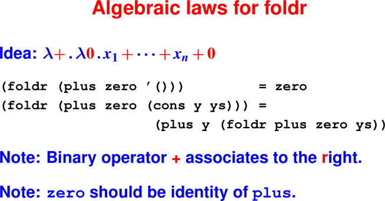
<hr>


`foldr` takes two arguments:

 * `zero`: What to do with the empty list.

 * `plus`: How to combine next element with running results.

Example: `foldr plus zero '(a b)`
```
    cons a (cons b '())
     |       |      |
     v       v      v
    plus a (plus b zero)
```
<hr>
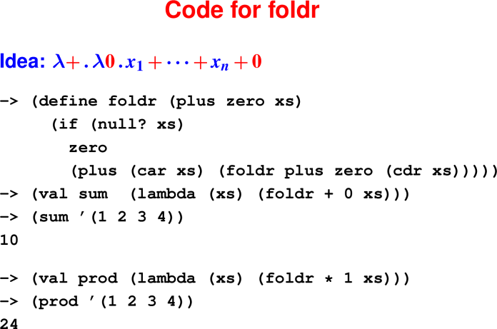
<hr>

<hr>
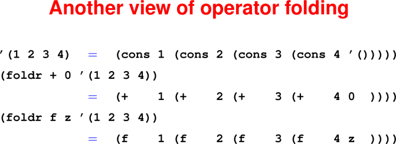
<hr>

#### In-class exercise: Folding `combine?`

<hr>
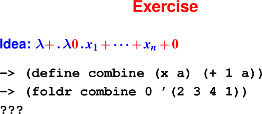
<hr>

<hr>
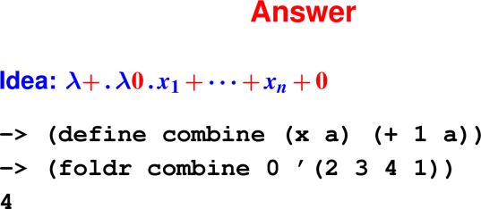
<hr>

## Tail calls (2.16.2 in book, not covered in class)

Intuition: In a function, a call is in *tail position* if it is the last 
thing the function will do.

A tail call is a *call in tail position*.

Important for optimizations: Can change complexity class.

### What is tail position?

Tail position is defined inductively:

 * The body of a function is in tail position

 * When `(if e1 e2 e3)` is in tail position, so are `e2` and `e3`

 * When `(let (...) e)` is in tail position, so is `e`, and similary 
   for `letrec` and `let*`.

 * When` (begin e1 ... en)` is in tail position, so is `en`.

Idea: The **last thing that happens**

Anything in tail position is the **last thing executed**!

Key idea is **tail-call optimization**!

<hr>
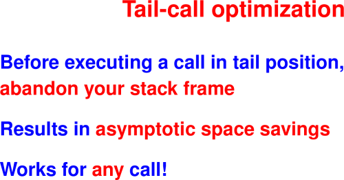
<hr>

<hr>
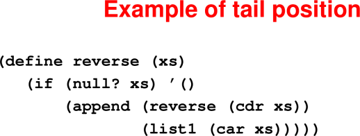
<hr>

<hr>
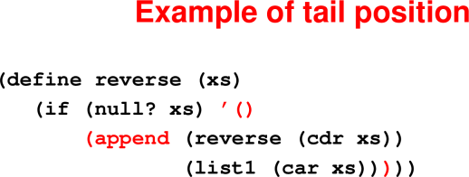
<hr>

Example: `reverse '(1 2)`

Question: How much stack space is used by the call?

Call stack:
```
    reverse '() 
    append
    reverse '(2)
    append
    reverse '(1 2)
```
Answer: Linear in the length of the list

<hr>
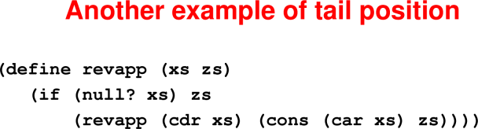
<hr>

<hr>
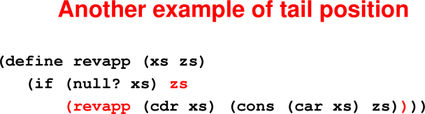
<hr>

Example: `revapp '(1 2) '()`

Question: How much stack space is used by the call?

Call stack: (each line replaces previous one)
```
    revapp '(1 2) '() –>

    revapp '(2)   '(1) –>

    revapp '()    '(2 1)
```
Answer: Constant

Question: Why can’t we do this same optimization on reverse?

Answer: reverse has to do further computation with results of recursive calls, so can’t eliminate the stack frame until later.

<hr>
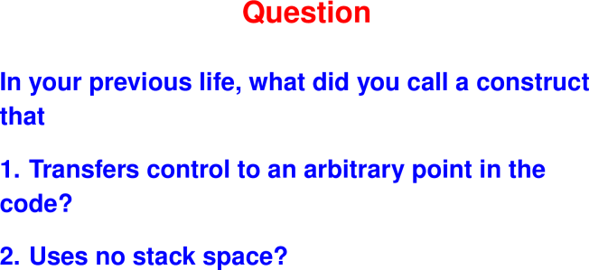
<hr>


Answer: a **goto**!!

Think of "tail call" as "goto with arguments"

