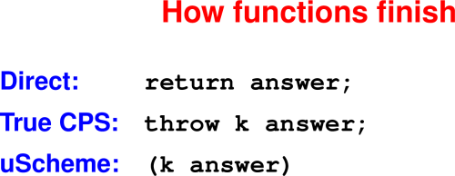
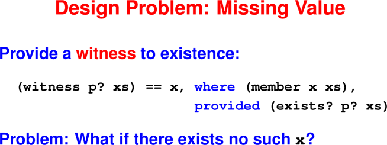
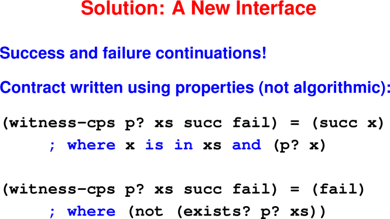
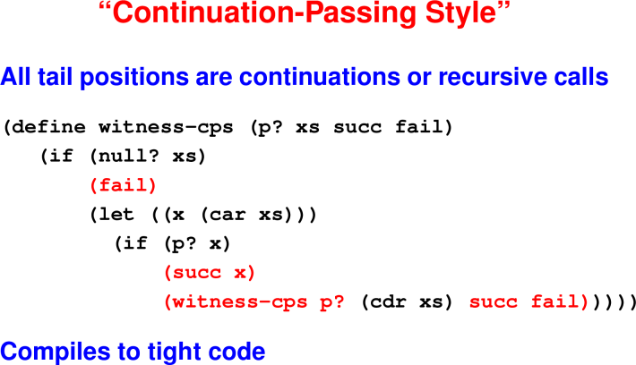
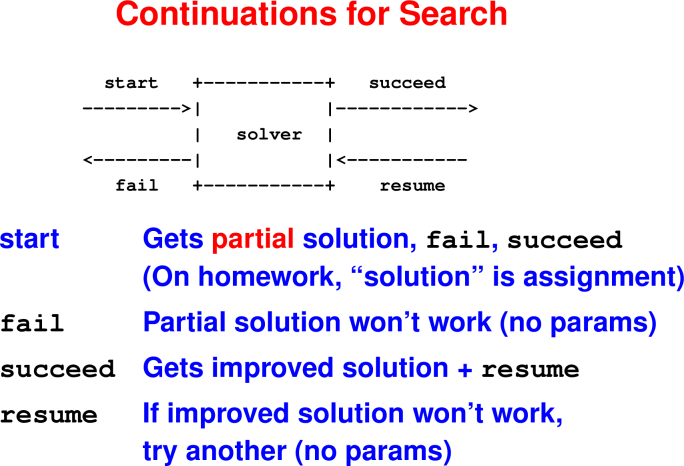

# Continuations

February 26, 2020

## Announcements

 * HW4 due Friday.
 * HW5 will be posted by Friday.
 * HW10 posting has been held up due to mlton compilation issues.


## Last Time

 * Closures to create "private" variables
 * High order function curry
 * Reasoning about Functions
 * Useful Higher-Order Functions
 * Tail Calls

## Today

 * Continuations


## Continuations

A continuation is code that represents “the rest of the computation.”

Not a normal function call because continuations never return
Think “goto with arguments”

### Different coding styles

**Direct style**: Last action of a function is to return a value. 
(This style is what you are used to.)

**Continuation-passing style (CPS)**: Last action of a function is to "throw" 
a value to a continuation.

### Uses of continuations

 * Call-backs in GUI frameworks

 * A style of coding that can mimic exceptions

 * Some languages provide a construct for capturing the current continuation 
   and giving it a name k. Control can be resumed at captured continuation by 
   throwing to k.

 * Compiler representation: Compilers for functional languages often convert 
   direct-style user code to CPS because CPS matches control-flow of assembly.

### Implementation

 * First-class continuations require compiler support.

 * First-class continuations require compiler support: primitive function that 
   materializes "current continuation" into a variable. (Missing chapter number 
   3.)

 * We're going to simulate continuations with function calls in tail position.

<hr>

<hr>


## Motivating Example: From existence to witness

<hr>

<hr>

Ideas?

Bad choices:

 * nil
 * special symbol `'fail`
 * run-time error

Good choice:

 * exception (not in uScheme)

<hr>

<hr>

### Your turn: Refine the laws
```
(witness-cps p? xs succ fail) = (succ x)
     ; where x is in xs and (p? x)
(witness-cps p? xs succ fail) = (fail)
     ; where (not (exists? p? xs))

(witness-cps p? '() succ fail) = ?

(witness-cps p? (cons z zs) succ fail) = ?
    ; when (p? z)

(witness-cps p? (cons z zs) succ fail) = ?
    ; when (not (p? z))
```

### Answers: Refine the laws
```
(witness-cps p? xs succ fail) = (succ x)
     ; where x is in xs and (p? x)
(witness-cps p? xs succ fail) = (fail)
     ; where (not (exists? p? xs))

(witness-cps p? '() succ fail) = (fail)

(witness-cps p? (cons z zs) succ fail) = (succ z)
    ; when (p? z)

(witness-cps p? (cons z zs) succ fail) = 
     (witness-cps p? zs succ fail)  
    ; when (not (p? z))
```

### Coding with continuations
```
(define witness-cps (p? xs succ fail)
   (if (null? xs)
       (fail)
       (let ((x (car xs)))
         (if (p? x)
             (succ x)
             (witness-cps p? (cdr xs) succ fail)))))
```

<hr>

<hr>

Question: How much stack space is used by the call?

Answer: Constant

### Example Use: Instructor Lookup

-> (val 2020spring '((Strout 520) (Sethi 536) (Hartman 542)))
-> (instructor-info 'Strout 2020spring)
(Strout teaches 520)
-> (instructor-info 'Hartman 2020spring)
(Hartman teaches 520)
-> (instructor-info 'Proebsting 2020spring)
(Proebsting is-not-on-the-list)

### Instructor Lookup: The Code

```
    ;; info has form: '(Strout 520)
    ;; classes has form: '(info_1, ..., info_n)
    (define instructor-info (instructor classes)
        (let (
                ; success continuation
                (s (lambda (info)
                    (list3 instructor 'teaches (cadr info))))

                ; failure continuation
                (f (lambda ()
                    (list2 instructor 'is-not-on-the-list))))
            
                (witness-cps (o ((curry =) instructor) car)
                    classes s f))
```

## Extended Continuation Example: A SAT Solver

### Exercise: Find a satisfying assignment if one exists
```
(val f1 '(and x y z w p q (not x)))

(val f2 '(not (or x y)))

(val f3 '(not (and x y z)))

(val f4 '(and (or x y z) 
              (or (not x) (not y) (not z))))
```

### Satisfying assignments
```
(val f1 '(and x y z w p q (not x))) ; NONE

(val f2 '(not (or x y))) 
                  ; { x |-> #f, y |-> #f }

(val f3 '(not (and x y z))) 
                  ; { x |-> #f, ... }
(val f4 '(and (or x y z) 
              (or (not x) (not y) (not z))))
              ; { x |-> #f, y |-> #t, ... }
```

<hr>

<hr>


### Solving a Literal, variable `x`

`start` carries a partial truth assignment to variables in `current`

Box describes how to extend `current` to make a variable, say `x`, true.

**Case 1: current(x) = #t**

Call `success` continuation with `current`

Pass `fail` as resume continuation (argument to `success`)

**Case 2: current(x) = #f**

Call `fail` continuation

**Case 3: x not in current**

Call `success` continuation with `current{x -> #t}`

Pass fail as resume continuation

### Solving a Negated Literal (Your turn)

`start` carries a partial truth assignment to variables `current`

Box describes how to extend current to make a negated variable, say `not x`, 
true.

**Case 1: current(x) = #f**

Call `success` continuation with `current`

Pass `fail` as resume continuation (argument to `success`)

**Case 2: current(x) = #t**

Call `fail` continuation

**Case 3: x not in current**

Call `success` cotinuation with `current{x -> #f}`

Pass `fail` as `resume` continuation

These diagrams (and the corresponding code) **compose!**

LEFTOFF

Solving A and B
Picture of A and B

Solver enters A

If A is solved, newly allocated success continuation starts B

If B succeeds, we’re done! Use success continuation from context.

If B fails, use resume continuation A passed to B as fail.

If A fails, the whole thing fails. Use fail continuation from context.


Solving A or B
Picture of A or B

Solver enters A

If A is solved, we’re good! But what if context doesn’t like solution? It can resume A using the resume continuation passed out as fail.

If A can’t be solved, don’t give up! Try a newly allocated failure continuation to start B.

If ever B is started, we’ve given up on A entirely. So B’s success and failure continuations are exactly the ones in the context.

If B succeeds, but the context doesn’t like the answer, the context can resume B.

If B fails, abject failure all around; call the original fail continuation.

