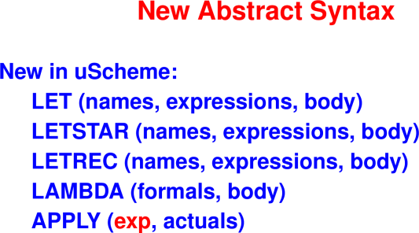
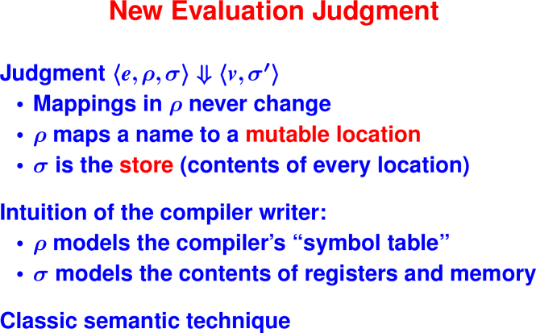
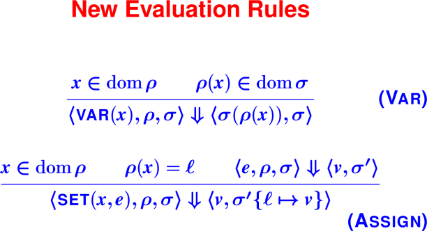
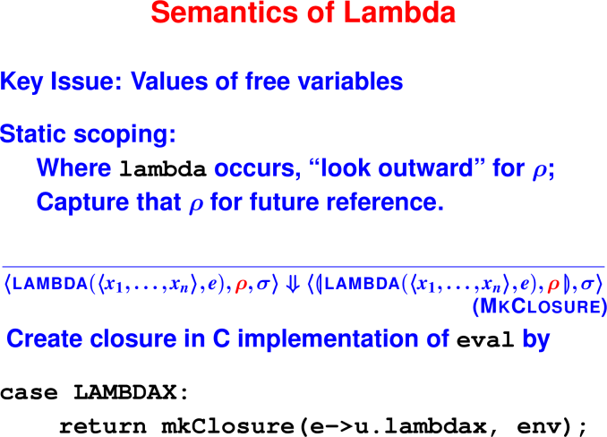
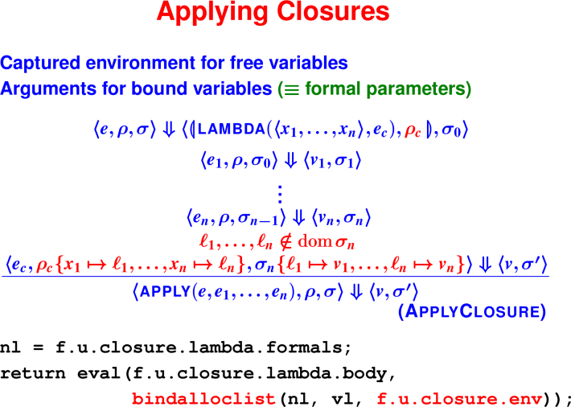
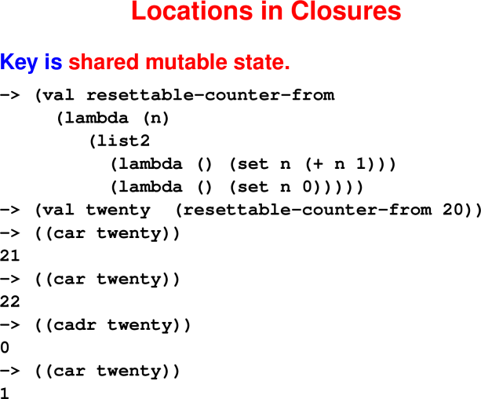

# Scheme Semantics

March 2, 2020

## Announcements

 * HW5 is due Friday
 * Next week is Spring Break
 * Study guide will be posted by the end of the week

## Today

Scheme Semantics

 * Stores

 * Lambdas evaluate to closures

 * Application


## Last Time

 * Continuations as "gotos with arguments"
 
 * Example: Handling missing values (association list)

 * Example: Structuring a search (SAT solver)

## New Syntax, Values, Environments, and Evaluation Rules

First four of five questions: Syntax, Values, Environments, Evaluation

Key changes from Impcore:

 * New constructs: let, lambda, application (not just named functions)

<hr>

<hr>


 * New values: cons cells and functions (closures)

 * A **single** kind of environment

   * Environment maps names to mutable locations, not values.

   * A **store** maps locations to values.

   * Environments get **copied** (in closures).

<hr>

<hr>


* It’s not precisely true that rho never changes.
* New variables are added when they come into scope.
* Old variables are deleted when they go out of scope.
* But the location associated with a variable never changes.

The book includes all rules for uScheme. Here we will discuss key rules.

### Variables

<hr>

<hr>

Board: Picture of environment pointing to store.

Questions about Assign:

 * What changes are captured in σ′?

 * What changes are captured in σ′{ℓ↦v}?

 * What would happen if we used σ instead of σ′

 * What would happen if we used a fresh ℓ?

 * Some other ℓ in the range of ρ?

### Lambdas

<hr>

<hr>

### Function Application

Example

```
  (val even (lambda (x) (= 0 (mod x 2)))) 

  (val f    (lambda (y) (if (even y) 5 15)))

  (val even 3)

  (f 10)
```

**Question**: Which `even` is referenced when `f` is called?

**Answer**: INCORRECT(With static scoping, it's the predicate. With dynamic scoping it's the one bound to 3.)
Based on the semantics for uscheme, `even` is 3 when f is called,
because when the closure is created it stores the location the variable points to
and in `(val even 3)` it is the location that is updated.

<hr>

<hr>

Questions about ApplyClosure:

 * What if we used σ instead of σ0 in evaluation of e1?

 * What if we used σ instead of σ0 in evaluation of arguments?

 * What if we used ρc instead of ρ in evaluation of arguments?

 * What if we did not require ℓ1, …, ℓn ∉ dom(σ)?

 * What is the relationship between ρ and σ?

<hr>

<hr>

Picture of environment and store that results from executing above program.

Closure Optimizations

 * Major issue in making functional programs efficient
   * Keep closures on the stack
   * Share closures
   * Eliminate closures (when functions don't escape)
