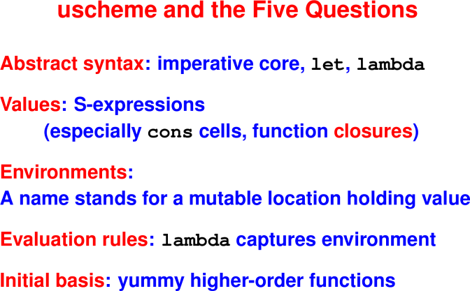

# Scheme Wrap-up; ML Intro

March 2, 2020

## Announcements

 * HW5 is due Friday
 * Next week is Spring Break
 * Study guide will be posted by the end of the week

## Today

 * Scheme Wrap-up
 * Intro to ML

## Last Time

 * Scheme semantics

 * Single kind of environment that maps names to locations.

 * A store maps locations to values.

 * Functions & Closures (will finish today)

 * Application (will finish today)


## Lisp and Scheme Retrospective

<hr>

<hr>

## Common Lisp, Scheme

Advantages:

 * High-level data structures
 * Cheap, easy recursion
 * Automatic memory management (garbage collection!)
 * Programs as data!
 * Hygenic macros for extending the language
 * Big environments, tiny interpreters, everything between
 * Sophisticated Interactive Development Environments
 * Used in AI applications; ITA; Paul Graham’s company Viaweb

Downsides:

 * Hard to talk about data
 * Hard to detect errors at compile time

Bottom line: it’s all about lambda

 * Major win
 * Real implementation cost (heap allocation)

## Bonus content: Scheme as it really is

 * (1) Macros!
 * (2) Cond expressions (solve nesting problem)
 * (3) Mutation
 * …

### Macros!
Real Scheme: Macros

 * A Scheme program is just another S-expression

 * Function define-syntax manipulates syntax at compile time

 * Macros are hygienic—name clashes impossible

 * let, and, many others implemented as macros

### Conditional expressions

Real Scheme: Conditionals
```
(cond (c1 e1)    ; if c1 then e1
      (c2 e2)    ; else if c2 then e2
       ...            ...
      (cn en))   ; else if cn then en

; Syntactic sugar---'if' is a macro:
(if e1 e2 e3) == (cond (e1 e2)
                       (#t e3))
```

### Mutation

Real Scheme: Mutation

 * Not only variables can be mutated.

 * Mutate heap-allocated cons cell:
```
   (set-car! '(a b c) 'd)  => (d b c)
```

Circular lists, sharing, avoids allocation

still for specialists only


## Introduction to ML

Apply your new knowledge in Standard ML:

 * You've already learned (most of) the ideas
 * There will be a lot of new detail
 * Good language for implementing language features
 * Good language for studying type systems

Lectures on ML:

 * (1) Algebraic types and pattern matching
 * (2) Exceptions
 * (3) An introduction to types
 
**Meta**: Not your typical introduction to a new language

 * Not definition before use, as in a manual
 * Not tutorial, as in Ullman
 * Instead, the **most important** ideas that are **most connected** to your 
   work up to now

## ML Overview

Designed for programs, logic, symbolic data

Theme: Precise ways to describe data

ML = uScheme + pattern matching + exceptions + static types

### uScheme -> ML Rosetta Stone
```
uScheme                    SML


 (cons x xs)             x :: xs

 '()                     []
 '()                     nil

 (lambda (x) e)          fn x => e

 (lambda (x y z) e)      fn (x, y, z) => e

 ||  &&                  andalso    orelse


 (let* ([x e1]) e2)      let val x = e1 in e2 end

 (let* ([x1 e1]          let val x1 = e1
        [x2 e2]              val x2 = e2
        [x3 e3]) e)          val x3 = e3
                         in  e
                         end
```

### Three new ideas

 * (1) Pattern matching is big and important. You will like it.
 * (2) Exceptions are easy
 * (3) Static types get two to three weeks in their own right.

Pattern matching makes code look more like algebraic laws: one pattern for 
each case.

Static types tell us at compile time what the cases are.

And lots of new concrete syntax!

### Examples

The `length` function.

* Algebraic laws:
```
length []      = 0
length (x::xs) = 1 + length xs
```
* The code:
```
fun length [] = 0
|   length (x::xs) = 1 + length xs
```
* Things to notice:
   * No parentheses! (Yay!)
   
   * Function application by juxtaposition

   * Infix operators

   * Function application has **higher precedence than any infix operator**

   * Compiler checks all the cases (try in the interpreter)

* Let’s try another! map, filter, exists, all, take, drop, takewhile, dropwhile

  * Length
    ```
    fun length [] = 0
      | length (x::xs) = 1 + length xs

    val res = length [1,2,3]
    ```

  * Map
    ```
    fun map f [] = []
      | map f (x::xs) = (f x) :: (map f xs)

    val res1 = 
      map length [[], [1], [1,2], [1,2,3]]
    ```
  
  * Map, without redundant parentheses
    ```
    fun map f []      = []
      | map f (x::xs) =  f x  ::  map f xs

    val res1 =
      map length [[], [1], [1,2], [1,2,3]]
    ```
 
  * Filter
    ```
    fun filter pred [] = [] 
      | filter pred (x::xs) =   (* pred? not legal *)
          let val rest = filter pred xs 
          in if pred x then
               (x::rest) 
             else rest
          end

    val res2 = 
        filter (fn x => (x mod 2) = 0) [1,2,3,4]

    (* Note fn x => e is syntax for lambda in SML *)
    ```

  * Filter, without redundant parentheses
    ```
    fun filter pred []      = []
      | filter pred (x::xs) =  (* no 'pred?' *)
          let val rest = filter pred xs
          in  if pred x then
                 x :: rest
              else
                rest
          end

    val res2 =
      filter (fn x => (x mod 2) = 0) [1,2,3,4]
    ```

  * Exists
    ```
    fun exists pred [] = false
      | exists pred (x::xs) = 
          (pred x) orelse (exists pred xs)

    val res3 = 
      exists (fn x => (x mod 2) = 1) [1,2,3,4]
    ```

  * Exists, without redundant parentheses
    ```
    fun exists pred []      = false
      | exists pred (x::xs) =
           pred x  orelse  exists pred xs

    val res3 =
      exists (fn x => (x mod 2) = 1) [1,2,3,4]
    ```

  * All
    ```
    fun all pred [] = true
      | all pred (x::xs) =
          (pred x) andalso (all pred xs)

    val res4 = all (fn x => (x >= 0)) [1,2,3,4]
    ```

  * All, without redundant parentheses
    ```
    fun all pred []      = true
      | all pred (x::xs) =
          pred x andalso all pred xs

    val res4 = all (fn x => (x >= 0)) [1,2,3,4]
    ```

  * Take
    ```
    exception ListTooShort
    fun take 0     l   = []
      | take n    []   = raise ListTooShort
      | take n (x::xs) = x::(take (n-1) xs)

    val res5 = take 2 [1,2,3,4]
    val res6 = take 3 [1] 
               handle ListTooShort => 
                 (print "List too short!"; [])

    (* Note use of exceptions. *)
    ```

  * Take, without redundant parentheses
    ```
    exception TooShort
    fun take 0 _       = []  (* wildcard! *)
      | take n []      = raise TooShort
      | take n (x::xs) = x ::  take (n-1) xs

    val res5 = take 2 [1,2,3,4]
    val res6 = take 3 [1]
               handle TooShort =>
                 (print "List too short!"; [])

    (* Note use of exceptions. *)
    ```

  * Drop
    ```
    fun drop 0     l   = l
      | drop n    []   = raise ListTooShort
      | drop n (x::xs) = (drop (n-1) xs)

    val res7 = drop 2 [1,2,3,4]
    val res8 = drop 3 [1] 
               handle ListTooShort => 
                  (print "List too short!"; [])
    ```

  * Takewhile
    ```
    fun takewhile p [] = []
      | takewhile p (x::xs) = 
          if p x then (x::(takewhile p xs)) 
                 else []

    fun even x = (x mod 2 = 0)
    val res8 = takewhile even [2,4,5,7]
    val res9 = takewhile even [3,4,6,8]
    ```

  * Takewhile, without redundant parentheses
    ```
    fun takewhile p [] = []
      | takewhile p (x::xs) =
          if p x then  x ::  takewhile p xs
          else []

    fun even x = (x mod 2 = 0)
    val res8 = takewhile even [2,4,5,7]
    val res9 = takewhile even [3,4,6,8]
    ```

  * Drop while
    ```
    fun dropwhile p [] = []
      | dropwhile p (zs as (x::xs)) = 
          if p x then (dropwhile p xs) else zs
    val res10 = dropwhile even [2,4,5,7]
    val res11 = dropwhile even [3,4,6,8]

    (* fancy pattern form: zs as (x::xs) *
    ```

  * Dropwhile, without redundant parentheses
    ```
    fun dropwhile p []              = []
      | dropwhile p (zs as (x::xs)) =
          if p x then  dropwhile p xs  else zs
    val res10 = dropwhile even [2,4,5,7]
    val res11 = dropwhile even [3,4,6,8]

    (* fancy pattern form: zs as (x::xs) *)
    ```

  * Folds
    ```
    fun foldr p zero [] = zero
      | foldr p zero (x::xs) = p (x, (foldr p zero xs))
 
    fun foldl p zero [] = zero
      | foldl p zero (x::xs) = foldl p (p (x, zero)) xs


    val res12 = foldr (op +)  0 [1,2,3,4] 
    val res13 = foldl (op * ) 1 [1,2,3,4] 

    (* Note 'op' to use an infix operator as a value. *)
    ```

  * Folds, without redundant parentheses
    ```
    fun foldr p zero []      = zero
      | foldr p zero (x::xs) = p (x,  foldr p zero xs )

    fun foldl p zero []      = zero
      | foldl p zero (x::xs) = foldl p (p (x, zero)) xs


    val res12 = foldr (op +)  0 [1,2,3,4]
    val res13 = foldl (op * ) 1 [1,2,3,4]

    (* Note 'op' to use infix operator as a value *)
    ```

## ML—The Five Questions

Syntax: definitions, expressions, **patterns**, **types**

Values: num/string/bool, **record/tuple**, algebraic data

Environments: names stand for **values** (and types)

Evaluation: uScheme + `case` and **pattern matching**

Initial Basis: medium size; emphasizes lists

(Question Six: type system—a coming attraction)

