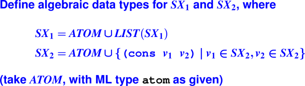
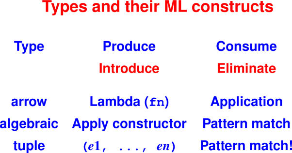
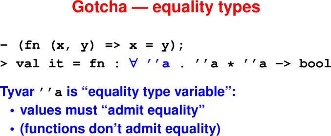
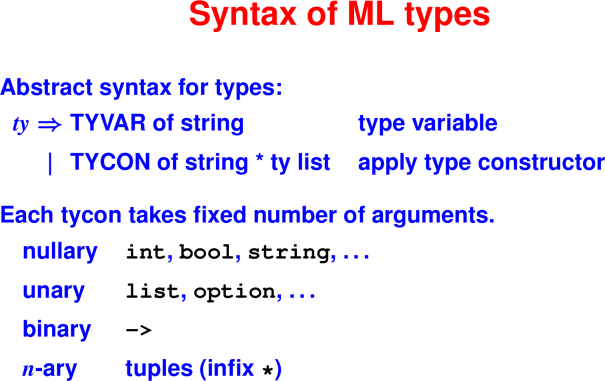
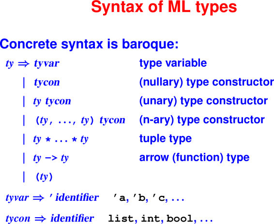
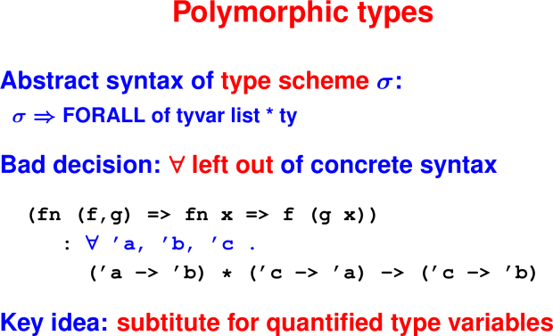
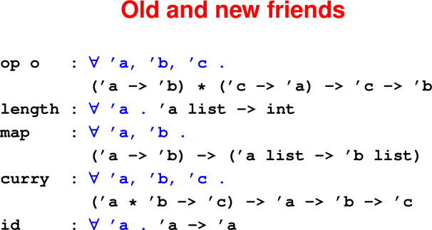

# Programming with constructed data and types

March 25, 2020

## Announcements

 * HW6 is due Friday


## Today

 * Datatypes
 * Types, Patterns, Exceptions
 * ML Traps & Pitfalls

## Last Time

 * Intro to ML


## Foundation: Data

Syntax is always the presenting complaint, but data is what's always important

* Base types: `int`, `real`, `bool`, `char`, `string`

* Functions

* Constructed data:
   * Tuples: pairs, triples, etc
   * (Records with named fields)
   * Lists and other algebraic data types

"Distinguish one cons cell (or one record) from another"


## Algebraic Datatypes

### Enumerated types

Datatypes can define an enumerated type and associated values.
```
datatype suit = heart | diamond | spade | club
```
Here `suit` is the name of a new type.

The data constructors `heart`, `dimaond`, `spade`, and `club` are the 
values of type `suit`.

Data constructors are separated by vertical bars.

### Pattern matching

Datatypes are **deconstructed** using pattern matching.
```
fun toString heart = "heart"
  | toString diamond = "diamond"
  | toString spade = "spade"
  | toString club = "club"

val suitName = toString heart
```

### But wait, there's more: Data constructors can take arguments!
```
datatype IntTree = Leaf | Node of int * IntTree * IntTree
```

`IntTree` is the name of a new type.

There are two data constructors: `Leaf` and `Node`.

`Node`s take a tuple of three arguments: a value at the node, and 
left and right subtrees.

The keyword `of` separates the name of the data constructor and the 
type of its argument.

When fully applied, data constructors have the type of the defining datatype 
(ie, `IntTree`).

### Building values with constructors

We build values of type IntTree using the associated constructors: 
(Draw on board)
```
 val tempty = Leaf
 val t1 = Node (1, tempty, tempty)
 val t2 = Node (2, t1, t1)
 val t3 = Node (3, t2, t2)
```

What is the *in-order* traversal of t3?
```
 [1,2,1,3,1,2,1]
```

What is the *pre-order* traversal of t3?
```
 [3,2,1,1,2,1,1]
```

### Deconstruct values with pattern matching

(The `@` symbol denotes append in ML)
```
fun inOrder Leaf = []
  | inOrder (Node (v, left, right)) = 
       (inOrder left) @ [v] @ (inOrder right)

val il3 = inOrder t3

fun preOrder Leaf = []
  | preOrder (Node (v, left, right)) = 
       v :: (preOrder left) @ (preOrder right)

val pl3 = preOrder t3
```
`IntTree` is **monomorphic** because it has a single type.

Note though that the `inOrder` and `preOrder` functions only cared about 
the *structure* of the tree, not the payload value at each node.

### But wait, there's still more: Polymorphic datatypes!

Polymorphic datatypes are written using type variables that can be 
instantiated with any type.
```
datatype 'a tree = Child | Parent of 'a * 'a tree * 'a tree
```
`tree` is a **type constructor** (written in post-fix notation), which means 
it produces a type when applied to a type argument.

Examples:

* `int tree` is a tree of integers

* `bool tree` is a tree of booleans

* `char tree` is a tree of characters

* `int list tree` is a tree of a list of integers.

`'a` is a **type variable**: it can represent any type.

It is introduced on the left-hand of the `=` sign in the `datatype` declaration.
References on the right-hand side are types.

`Child` and `Parent` are data constructors.

`Child` takes no arguments, and so has type `'a tree`

When given a value of type `'a` and two `'a tree`s, `Parent` produces a
`'a tree`.

### Data Constructors build `tree` values
```
val empty = Child
val tint1 = Parent (1, empty, empty)
val tint2 = Parent (2, tint1, tint1)
val tint3 = Parent (3, tint2, tint2)

val tstr1 = Parent ("a", empty, empty)
val tstr2 = Parent ("b", tstr1, tstr1)
val tstr3 = Parent ("c", tstr2, tstr2)
```

### Pattern matching deconstructs tree values
```
fun inOrder Child = []
  | inOrder (Parent (v, left, right)) = 
       (inOrder left) @ [v] @ (inOrder right)

fun preOrder Child = []
  | preOrder (Parent (v, left, right)) = 
       v :: (preOrder left) @ (preOrder right)
```
Functions `inOrder` and `preOrder` are **polymorphic**: they work on any value 
of type `'a tree`. `'a` is a type variable and can be replaced with any type.

## Things to notice about datatypes

### Environments

Datatype declarations introduce names into:

1. the type environment: `suit`, `IntTree`, `tree`

2. the value environment: `heart`, `Leaf`, `Parent`

### Inductive

Datatype declarations are inherently inductive:

* the type `IntTree` appears in its own definition

* the type `tree` appears in its own definition

### Datatype Exercise

<hr>

<hr>

FIXME: confusing exercise

### Exercise answers
```
datatype sx1 = ATOM1 of atom
             | LIST1 of sx1 list

datatype sx2 = ATOM2 of atom
             | PAIR2 of sx2 * sx2
```

### Case expressions: How we use datatypes

Eliminate values of algebraic types

New language construct case (an expression)
```
fun length xs =
  case xs
    of []      => 0
     | (x::xs) => 1 + length xs
```

At top level, `fun` better than `case`

When possible, write
```
fun length []      = 0
  | length (x::xs) = 1 + length xs
```


`case` works for any datatype

```
 fun toStr t = 
     case t 
       of Leaf => "Leaf"
        | Node(v,left,right) => "Node"
```

But often pattern matching is better style:
```
 fun toStr' Leaf = "Leaf"
   | toStr' (Node (v,left,right)) = "Node"
```

### Bonus: Talking type theory: Introduction and elimination constructs

Part of learning any new field: talk to people in their native vocabulary

* **Introduce** means "produce", "create", "make", "define"

* **Eliminate** means "consume", "examine", "observe", "use"


<hr>

<hr>

## Tuple Pattern Matching

```
val (x,y) = (1,2)

val (left, pivot, right) = split xs

val (n,xs) = (3, [1,2,3])

val (x::xs) = [1,2,3]

val (_::xs) = [1,2,3]
```

## Exceptions: Handling unusual circumstances

### Syntax:

* Declaration: `exception EmptyQueue`

* Introduction: `raise e where e : exn`

* Elimination: `e1 handle pat => e2`

### Informal Semantics:

* alternative to normal termination

* can happen to any expression

* tied to function call
   * if evaluation of body raises exn, call raises exn

* Handler uses pattern matching

```
e handle pat1 => e1 | pat2 => e2
```

### Exception handling in action


    loop (evaldef (reader (), rho, echo))
    handle EOF            => finish ()
      | Div               => continue "Division by zero"
      | Overflow          => continue "Arith overflow"
      | RuntimeError msg  => continue ("error: " ^ msg)
      | IO.Io {name, ...} => continue ("I/O error: " ^
                                       name)
      | SyntaxError msg   => continue ("error: " ^ msg)
      | NotFound n        => continue (n ^ "not found")


## Bonus Content: ML traps and pitfalls


### Order of clauses matters

```
fun take n (x::xs) = x :: take (n-1) xs
  | take 0 xs      = []
  | take n []      = []

(* what goes wrong? *)
```

### Gotcha — overloading

```
- fun plus x y = x + y;
> val plus = fn : int -> int -> int
- fun plus x y = x + y : real;
> val plus = fn : real -> real -> real
```

<hr>

<hr>


### Gotcha — parentheses

Put parentheses around anything with `|`

`case`, `handle`, `fn`

Function application has higher precedence than any infix operator

### Bonus content (seen in examples)

Syntactic sugar for lists
```
- 1 :: 2 :: 3 :: 4 :: nil; (* :: associates to the right *)
> val it = [1, 2, 3, 4] : int list

- "the" :: "ML" :: "follies" :: [];
> val it = ["the", "ML", "follies"] : string list

> concat it;
val it = "theMLfollies" : string
```

## Bonus content: ML from 10,000 feet

### Environments: The value environment

Names **bound to immutable values**

Immutable `ref` and `array` values point to mutable locations

ML has **no binding-changing assignment**

**Definitions** add new bindings (hide old ones):

```
val pattern = exp
val rec pattern = exp
fun ident patterns = exp
datatype … = …
```

### Environments: Nesting environments

At top level, **definitions**

Definitions contain expressions:
```
def ::= val pattern = exp
```
Expressions contain definitions:
```
exp ::= let defs in exp end
```
Sequence of defs has let-star semantics

### Patterns

What is a pattern?
```
pattern ::= variable
          | wildcard
          | value-constructor [pattern]
          | tuple-pattern
          | record-pattern
          | integer-literal
          | list-pattern
```
Design bug: **no lexical distinction** between

* VALUE CONSTRUCTORS
* variables

Workaround: programming convention

### Functions

Function pecularities: 1 argument

Each function takes 1 argument, returns 1 result

For "multiple arguments," use tuples!
```
 fun factorial n =
   let fun f (i, prod) = 
         if i > n then prod else f (i+1, i*prod)
   in  f (1, 1)
   end


 fun factorial n =  (* you can also Curry *)
   let fun f i prod = 
         if i > n then prod else f (i+1) (i*prod)
   in  f 1 1
   end
```
Tuples are "usual and customary."
FIXME: When defining functions in a let clause?

<hr>

<hr>

### Types

<hr>

<hr>
<hr>

<hr>
<hr>

<hr>
<hr>

<hr>

