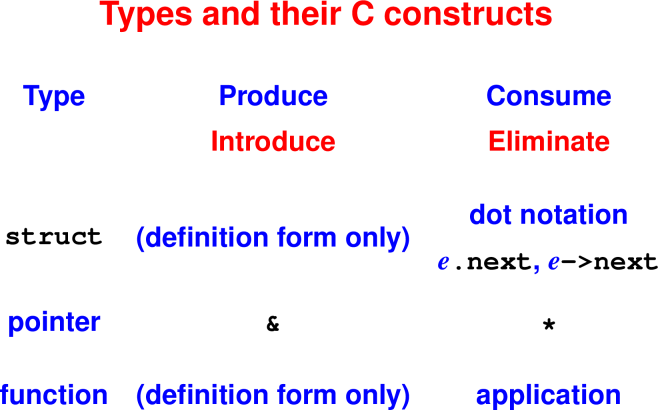
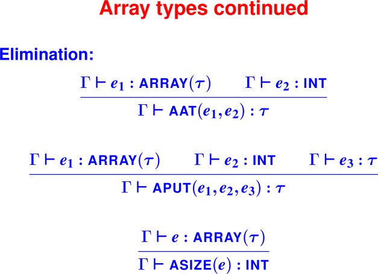
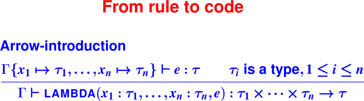

# Class notes on Types

April 1, 2020

## Announcements

 * HW7 is due Friday


## Last Time

 * Type systems with two types

 * Typing rules for a simple language

 * Type checker for a simple language

 * Adding environments

## Today

* What is type soundness?

* Formation, Introduction, and Elimination Rules

* Type checking with type constructors

## Type soundness

<hr>

<hr>

## Approaching types as programmers

### Understanding language design

Questions about types never seen before (aka new types):

* What types can I make?
* What syntax goes with each form?
* What functions?
* What about user-defined types?

Examples: pointer, struct, function, record

### Talking type theory

* **Formation**: make new types

* **Introduction**: make new values

* **Elimination**: observe ("take apart") existing values

# Talking type theory: Introduction and elimination constructs

Part of learning any new field: talk to people in their native vocabulary

* Introduce means "produce", "create", "make", "define" for a value

* Eliminate means "consume", "examine", "observe", "use", "mutate"


<hr>

<hr>

<hr>

<hr>

<hr>

<hr>


# Functions

Here is an example of how to type "introducing" a value and 
"eliminating" a value.

Introduction:
```
Gamma{x->tau1} |- e : tau2   
------------------------------------------------------------
Gamma |- fn x : tau1 => e  : tau1 -> tau2
```

Elimination:
```
Gamma |- e  : tau1 -> tau2   
Gamma |- e1 : tau1
------------------------------------------------------------
Gamma |- e e1 : tau2
```

# Where we’ve been and where we’re going

New watershed in the homework

* You've been developing and polishing programming skills: recursion, 
  higher-order functions, using types to your advantage. But the problems have 
  been mostly simple problems around simple data structures, mostly lists.

* We're now going to shift and spend the next several weeks doing real 
  programming-languages stuff, starting with type systems.

* You've already seen everything you need to know to implement a basic type 
  checker, and you are almost fully equipped to add array operations and types 
  to Typed Impcore.

What's next is much more sophisticated type systems, with an infinite number of types. We'll focus on two questions about type systems:

* What is and is not a good type, that is, a classifier for terms?

* How shall we represent types?

We'll look at these questions in two contexts: monomorphic and polymorphic 
languages.


# Monomorphic vs Polymorphic Types

Monomorphic types have no type parameters

* Examples: `int, bool, int -> bool, int * int`

Polymorphic types have type parameters

* Examples: 'a list, 'a list -> 'a list, ('a * int)


# Design and implementation of monomorphic languages

Mechanisms:

* Every new variety of type requires **special syntax** 
  (examples: structs, pointers, arrays)

* Implementation is a straightforward application of what you already know.

Language designer's process when adding new kinds of types:

* What new types do I have (**formation rules**)?

* What new syntax do I have to *create new values with that type*
  (**introduction rules**)?

  For introduce think "produce", "create", "make", "define"

* What new syntax do I have to observe terms of a type (**elimination rules**)?

  For eliminate think "consume", "examine", "interrogate", "look inside", or 
  "take apart", "observe", "use", "mutate"

Words "introduce" and "eliminate" are the native vocabulary of type-theoretic 
language design—it’s like knowing what to say when somebody sneezes.

Question: If I add lists to a language, how many new types am I introducing?

# Managing the set of types: Type Formation

## Examples: Well-formed types

These are types:

* `int`
* `bool`
* `int * bool`
* `int * int -> int`

## Examples: Not yet types, or not types at all

These "types in waiting" don’t classify any terms

* `list` (but `int list` is a type)
* `array` (but `char array` is a type)
* `ref` (but `(int -> int) ref` is a type)


These are **utter nonsense**

* `int int`
* `bool * array`


## Type formation rules

We need a way to classify type expressions into:

* **types** that classify terms

* **type constructors** that build types

* **nonsense terms** that don't mean anything

## Type constructors

Technical name for "types in waiting"

Given zero or more arguments, produce a type:

* Nullary `int, bool, char` also called **base types**

* Unary `list, array, ref`

* Binary (infix) `->`

More complex type constructors:

* records/structs
* function in C, uScheme, Impcore

<hr>

<hr>


## Type judgments for monomorphic system

Two judgments:

* The old typing judgment Γ ⊢ e : τ

* Today's judgment "τ is a type"

## Monomorphic type rules

<hr>

<hr>

<hr>

<hr>

Notice: one rule for if!!

## Classic types for data structures

<hr>

<hr>

(At run time, identical to cons, car, cdr)

<hr>

<hr>

<hr>

<hr>

## Typical syntactic support for types

Explicit types on `lambda` and `define`:

* For `lambda`, argument types:
```
(lambda ([n : int] [m : int]) (+ (* n n) (* m m)))
```

* For define, argument and result types:
```
(define int max ([x : int] [y : int]) 
                (if (< x y) y x))
```

Abstract syntax:
```
datatype exp = ...
 | LAMBDA of (name * tyex) list * exp
    ...
datatype def = ...
 | DEFINE of name * tyex * ((name * tyex) list * exp)
    ...
```
    
<hr>

<hr>

<hr>

<hr>

## Typing Rule Exercise

<hr>

<hr>

<hr>

<hr>

## Coding the arrow-introduction rule

<hr>

<hr>

## Type-checking LAMBDA
```
datatype exp = LAMBDA of (name * tyex) list * exp 
   ...
fun ty (Gamma, LAMBDA (formals, body)) = 
  let val Gamma' = (* body gets new env *)
        foldl (fn ((x, ty), g) => bind (x, ty, g))
              Gamma formals
      val bodytype = ty(Gamma', body)
      val formaltypes = 
        map (fn (x, ty) => ty) formals
  in  funtype (formaltypes, bodytype)
  end
```
