# Polymorphic Type Checking

April 6, 2020

## Announcements

 * HW7 is due Wednesday

 * HW8 was posted last Friday and is due Wednesday April 15th

## Last Time

* What is type soundness?

* Formation, Introduction, and Elimination Rules

* Type checking with type constructors

## Today

* Polymorphic type systems (TypedUScheme)

* Generic type representations

* Kinds for classifying types

* Why we want to do type inference


# Limitations of monomorphic type systems

## Monomorphic types are limiting

Each new type constructor requires

* Special syntax

* New type rules

* New internal representation (type formation)

* New code in type checker (intro, elim)

* New or revised proof of soundness

<hr>
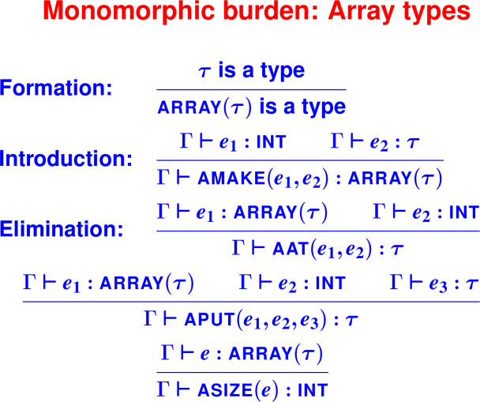
<hr>

Notes: Writing rules for lists on homework

## Monomorphism hurts programmers too

Monomorphism leads to code duplication

User-defined functions are monomorphic:
```
(define int lengthI ([xs : (list int)])
   (if (null? xs) 0 (+ 1 (lengthI (cdr xs)))))
(define int lengthB ([xs : (list bool)])
   (if (null? xs) 0 (+ 1 (lengthB (cdr xs)))))
(define int lengthS ([xs : (list sym)])
   (if (null? xs) 0 (+ 1 (lengthS (cdr xs)))))
```

## Quantified types
<hr>
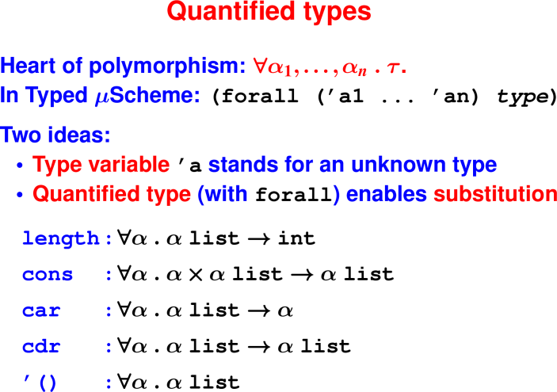
<hr>


<hr>
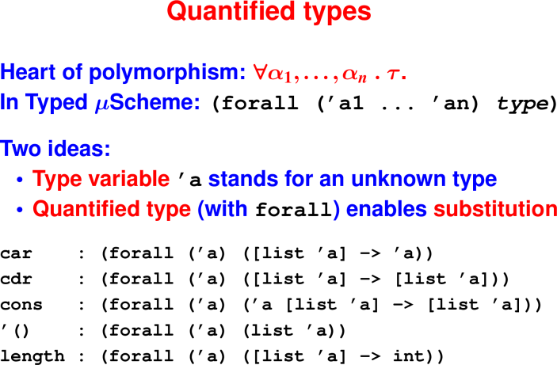
<hr>


## Type formation: Composing types

Punchline: Now we need a somewhat different approach to type creation, 
using kinds

Typed Impcore:

* **Closed world** (no new types)

* Simple formation rules

Standard ML:

* **Open world** (programmers create new types)

* How are types formed (from other types)?

Can't add **new syntactic forms** and **new type formation rules** for every new 
type.


<hr>
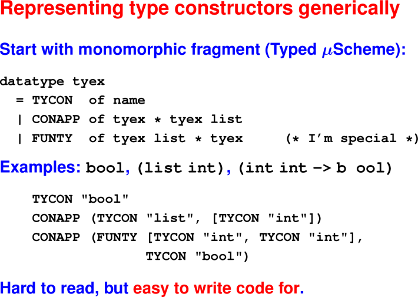
<hr>

<hr>
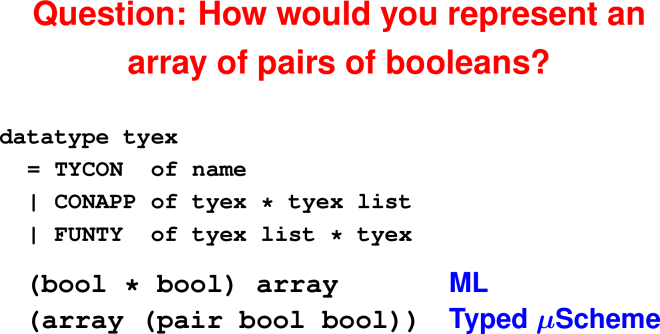
<hr>

<hr>
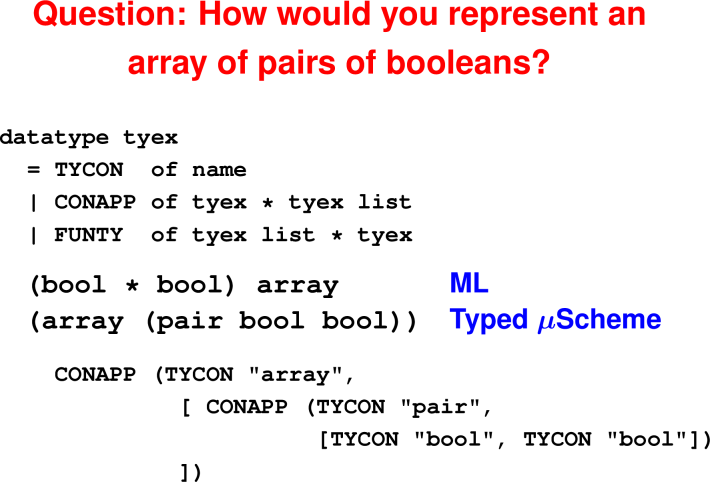
<hr>

## Well-formed types

We still need to classify type expressions into:

* **types** that classify terms (e.g., `int`)

* **type constructors** that build types (e.g., `list`)

* **nonsense** that means nothing (e.g., `int int`)

Idea: *kinds* classify types

one-off type-formation rules

Δ tracks type constructors, vars

# Polymorphic Type Checking

## Quantified types


<hr>
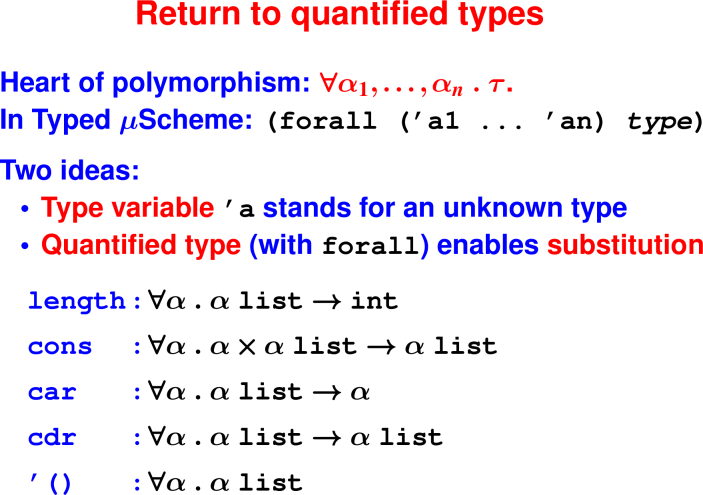
<hr>


## Representing quantified types

Two new alternatives for `tyex`:
```
datatype tyex
  = TYCON  of name
  | CONAPP of tyex * tyex list
  | FUNTY  of tyex list * tyex
  | TYVAR  of name
  | FORALL of name list * tyex
```


<hr>
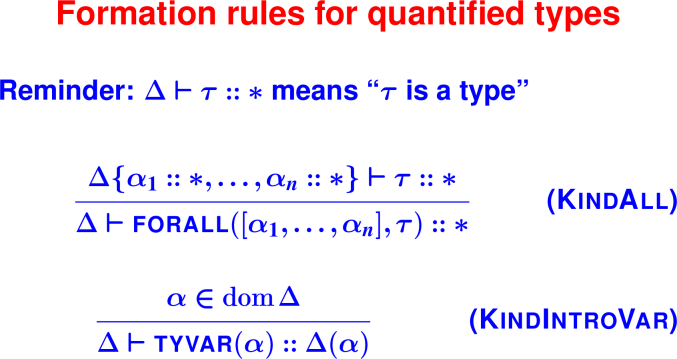
<hr>


## Programming with quantified types

Substitute for quantified variables
```
-> length                                                                          
<procedure> : (forall ('a) ((list 'a) -> int))                                     
-> (@ length int)                                                                  
<procedure> : ((list int) -> int)                                                  
-> (length '(1 2 3))
type error: function is polymorphic; instantiate before applying
-> ((@ length int) '(1 2 3))
3 : int
```

## Substitute what you like
```
-> length
 : (forall ('a) ((list 'a) -> int))
-> (@ length bool)
 : ((list bool) -> int)
-> ((@ length bool) '(#t #f))
2 : int
```

## More "Instantiations"

```
-> (val length-int (@ length int))                                                 
length-int : ((list int) -> int)                                                   
-> (val cons-bool (@ cons bool))
cons-bool : ((bool (list bool)) -> (list bool))
-> (val cdr-sym (@ cdr sym))
cdr-sym : ((list sym) -> (list sym))
-> (val empty-int (@ '() int))
() : (list int)
```

## Bonus instantiation:
```
-> map
<procedure> :
  (forall ('a 'b)
    (('a -> 'b) (list 'a) -> (list 'b)))
-> (@ map int bool)
<procedure> :
  ((int -> bool) (list int) -> (list bool))
```

## Create your own!

Abstract over unknown type using type-lambda

```
  -> (val id (type-lambda ['a]
                (lambda ([x : 'a]) x )))
  id : (forall ('a) ('a -> 'a))
```

'a is **type parameter** (an unknown type)

This feature is **parametric polymorphism**


## Power comes at notational cost

Function composition
```
-> (val o (type-lambda ['a 'b 'c]
    (lambda ([f : ('b -> 'c)]
             [g : ('a -> 'b)])
     (lambda ([x : 'a]) (f (g x))))))

o : (forall ('a 'b 'c)
       (('b -> 'c) ('a -> 'b) -> ('a -> 'c)))
```
Aka o : in uScheme?

## Type rules for polymorphism
<hr>
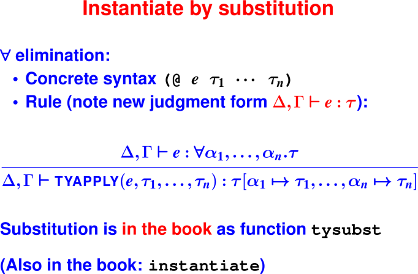
<hr>

<hr>
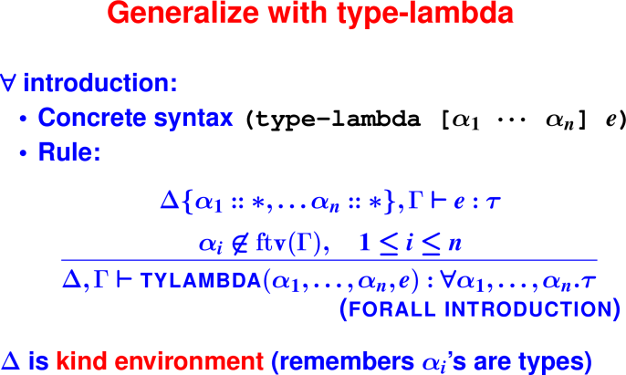
<hr>

## What have we gained?

No more introduction rules:
 * Instead, use polymorphic functions

No more elimination rules:
 * Instead, use instantiation of polymorphic functions

But, **we still need formation rules**

## You can't trust code

User's types not blindly trusted:
```
-> (lambda ([a : array]) (Array.size a))
type error: used type constructor `array' as a type
-> (lambda ([x : (bool int)]) x)
type error: tried to apply type bool as type constructor
-> (@ car list)
type error: instantiated at type constructor `list', which is not a type
```

How can we know which types are OK?

<hr>
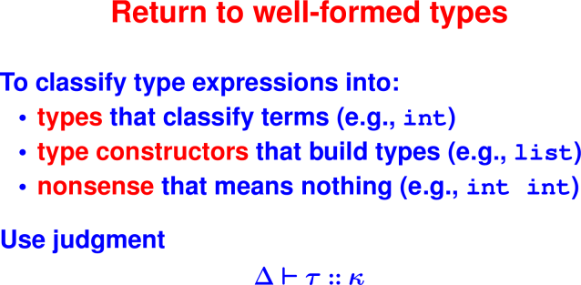
<hr>

<hr>
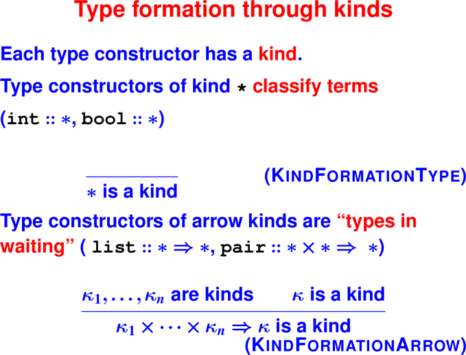
<hr>

<hr>

<hr>

<hr>
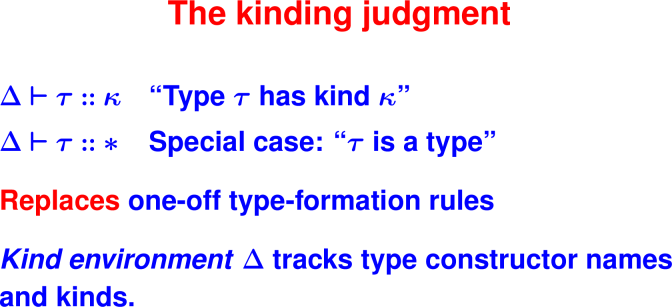
<hr>

<hr>
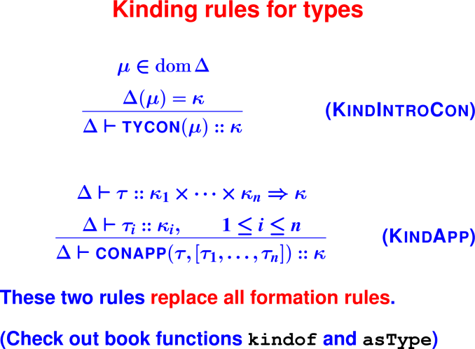
<hr>

<hr>
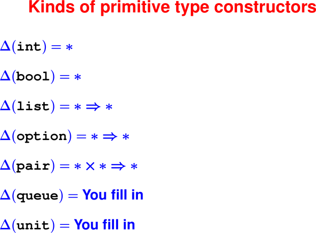
<hr>

# Opening a closed world: What can a programmer add?

Typed Impcore:

* **Closed world** (no new types)

* Simple formation rules

Typed μScheme:

* **Semi-closed world** (new type variables)

* How are types formed (from other types)?

Standard ML:

* **Open world** (programmers create new types)

* How are types formed (from other types)?


# Bonus content: a definition manipulates three environments

<hr>
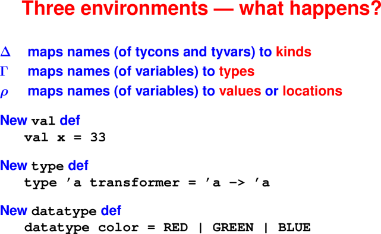
<hr>

<hr>
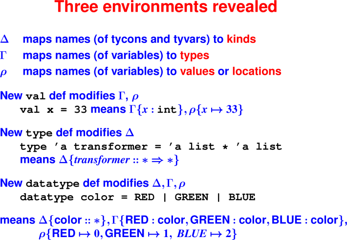
<hr>

<hr>
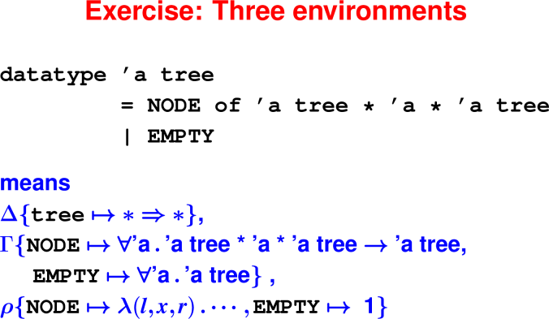
<hr>

# Type Inference introduction

How does the compiler or interpreter know the types without annotations?
```
fun append (x::xs) ys = x :: append xs ys
  | append []      ys = ys
```

Questions: where do explicit types appear in C?

Where do they appear in Typed μScheme?

Get rid of all that:

* Guess a type for each formal parameter
* Guess a return type
* Guess a type for each instantiation of a polymorphic type

## Key Ideas:
Fresh type variables represent unknown types.

Example: In (lambda (x) (+ x 3)), assign x fresh type variable α
Constraints record knowledge about type variables.

Example: α ≡ int

## Why Study?
Useful in its own right (as we'll see shortly)

Canonical example of Static Analysis, which is key tool in cybersecurity

## What type inference accomplishes

```
-> (define     double (x)       (+ x x))
double                         ;; uScheme

-> (define int double ([x : int]) (+ x x))
double : (int -> int)          ;; Typed uSch.

-> (define     double (x)       (+ x x))
double : int -> int            ;; nML
```
The compiler tells you useful information and there is a lower annotation 
burden.

## What else type inference accomplishes

```
-> ((@ cons bool) #t ((@ cons bool) #f (@ '() bool)))
(#t #f) : (list bool)    ;; typed uScheme

-> (   cons       #t (   cons       #f    '()      ))
(#t #f) : bool list      ;; nML
```

## How it works

1. For each unknown type, introduce a **fresh type variable**

2. Every typing rule adds **equality constraints**

3. Instantiate every variable automatically

4. Introduce polymorphism at `let/val` bindings


## Plan of Study
* today see a couple of examples for how to generate constraints
* Wednesday, many more examples with you doing somewhat
* Wednesday, you solving constraints by hand
* Wednesday and Monday, ideas for how to write constraint solver for HW8


## Example: if

`(if y 1 0)`

`y` has type `'a3`, `1` has type `int`, `0` has type `int`

Requires what constraints? (`int` = `int`, `'a3` = `bool`)

## Example: sometimes can't satisfy constraints

`(if z z (- 0 z))`

`z` has type `'a3`, `0` has type `int`, `-` has type `int * int -> int`

Requires what constraints? (`'a3 = bool /\ int = int /\ 'a3 = int`)

Is this possible?

Why not?
