# Type Instantiation and Generalization

April 13, 2020

## Announcements

 * HW8 is due Wednesday


## Last Time

* Type Inference

* Representing and solving type constraints

## Today

* HW7 and HW8 discussions

* From type scheme to types: Instantiation

* Generalization: going from types to type schemes
  * Inference rule for `val`
  * Inference for `let`
  * Inference for `val-rec` and `let-rec`

# From Type Scheme to Type

<hr>
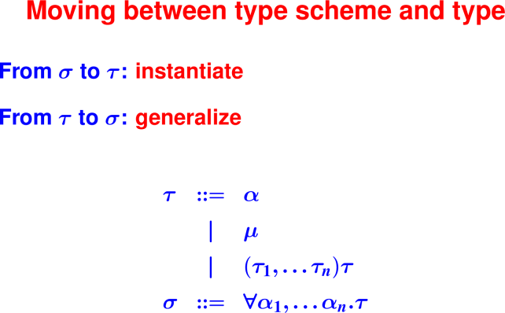
<hr>


<hr>
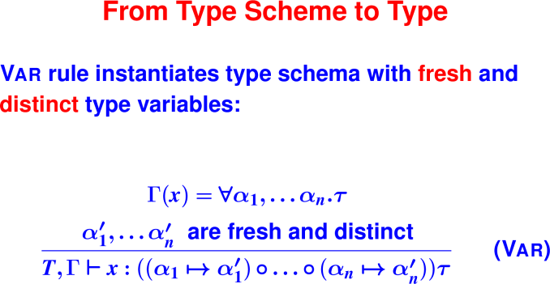
<hr>


## Why the freshness requirement?

Consider
```
Gamma = {fst : forall 'a 'b. 'a * 'b -> 'a, y : 'ay}

??, Gamma |- if (y, fst 2 3, 4) : ??
```

Imagine we ignore the freshness constraint when instantiating fst:
```
fst : 'ay * 'b -> 'ay
```

From if, we get the constraints:
```
'ay ~ bool

'ay ~ int
```
which aren't satisfiable. Which means this code would be erroneously flagged as 
an error.

Correct typing:
```
 'ay ~ bool, Gamma |- if (y, fst 2 3, 4) : int
```

## Why the distinctness requirement?

```
fst : 'a * 'a -> 'a

Gamma |- fst 2 #t
```

Application rule yields constraints:

```
'a ~ int

'a ~ bool
```

which aren't satisfiable. Which means this code would also be erroneously 
flagged as an error.

Correct typing:
```
Gamma |- fst 2 #t : int
```

# From Types to Type Scheme

<hr>
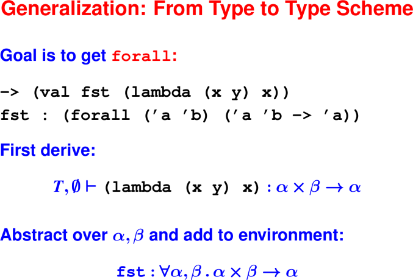
<hr>

<hr>
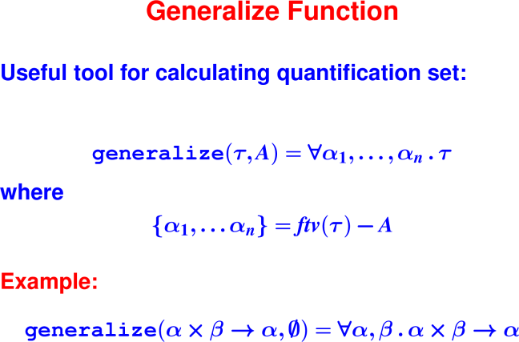
<hr>

The set A above will be useful when some variables in τ are mentioned in the 
environment.

We can't generalize over those variables.

Applying idea to the type inferred for the function `fst`:

```
generalize('a * 'b -> 'a, emptyset) = forall 'a, 'b. 'a * 'b -> 'a
```

<hr>
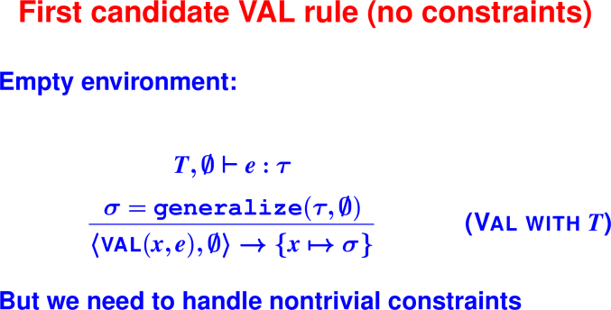
<hr>

Note the new judgement form above for type checking a declaration.

<hr>
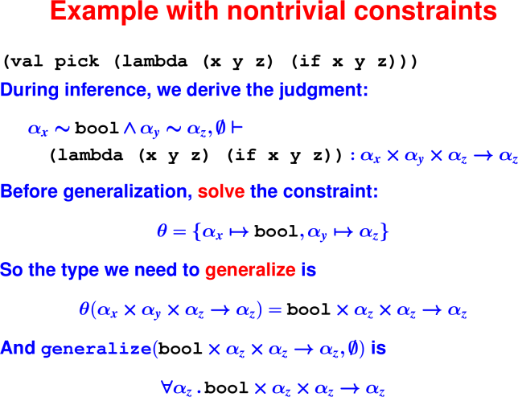
<hr>

<hr>
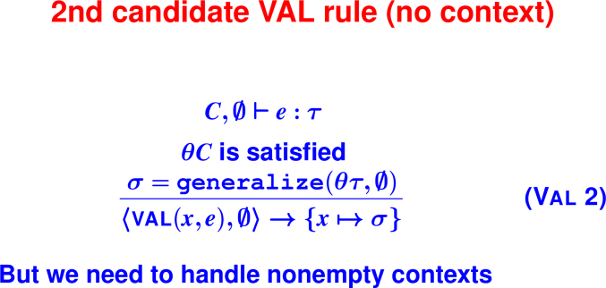
<hr>

<hr>
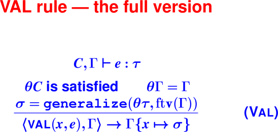
<hr>


On the condition θΓ = Γ: Γ is "input": it can’t be changed.
The condition ensures that θ doesn't conflict with Γ.

We can't generalize over free type variables in Γ.

Their presence indicates they can be used somewhere else, and hence they aren't 
free to be instantiated with any type.

<hr>
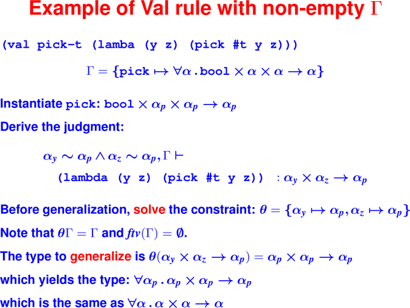
<hr>

# Type Inference for Lets and Recursive Definitions


## Let Examples
```
(lambda (ys)  ; OK
   (let ([s (lambda (x) (cons x '()))])
      (pair (s 1) (s #t))))

(lambda (ys)  ; Oops!
   (let ([extend (lambda (x) (cons x ys))])
      (pair (extend 1) (extend #t))))

(lambda (ys)  ; OK
    (let ([extend (lambda (x) (cons x ys))])
       (extend 1)))
```
<hr>
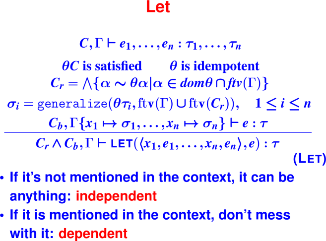
<hr>

## Let with constraints, operationally:

1. typesof: returns τ1, …, τn and C

2. val theta = solve C

3. C-prime from map, conjoinConstraints, dom, inter, freetyvarsGamma

4. freetyvarsGamma, union, freetyvarsConstraint

5. Map anonymous lambda using generalize, get all the σi

6. Extend the typing environment Gamma (pairfoldr)

7. Recursive call to type checker, gets C_b, \tau

8. Return (tau, C' /\ C_b)

<hr>
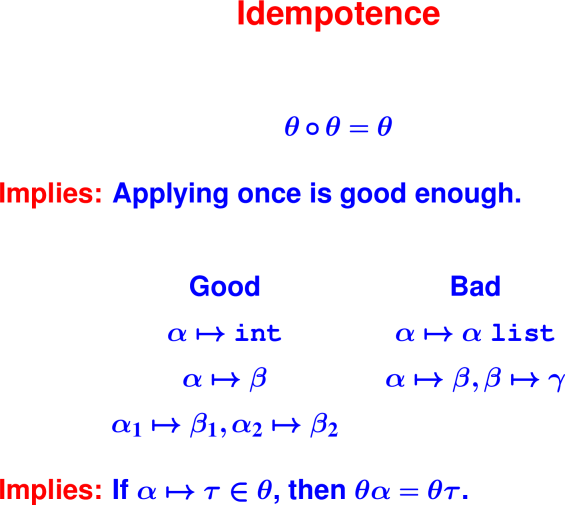
<hr>

<hr>
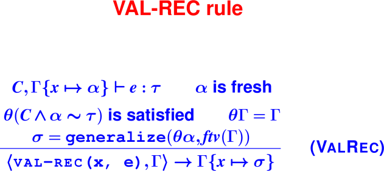
<hr>

 
<hr>
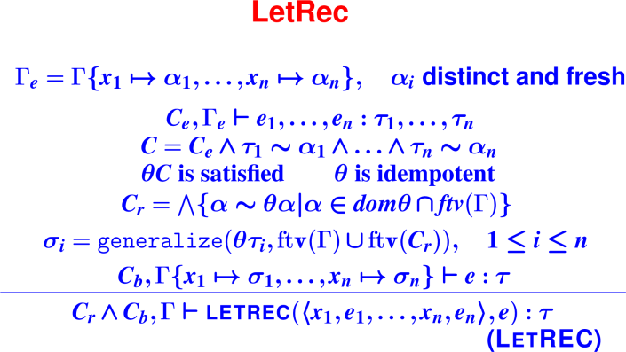
<hr>

Forall things

# Managing Quantified types

|        | val and val-rec | let, letrec, ... | lambda
| forall | FORALL contains all variables (because none are free in the context) | FORALL contains variables not free in the context | FORALL is empty |
| Generalize over all variables (because none are free in the context)	| Generalize over variables not free in the context	| Never generalize |
