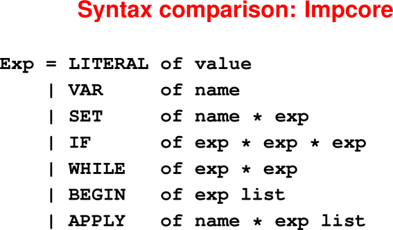
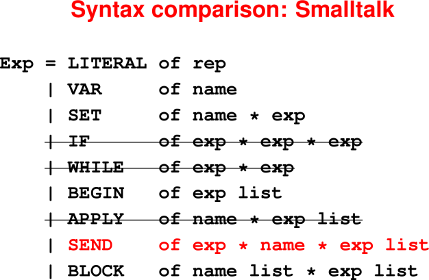
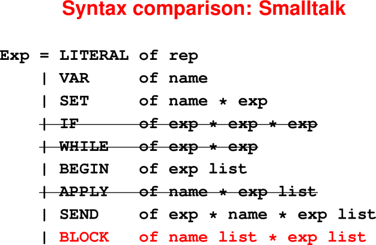

# Object Orientation

Notes used with permission from https://www.cs.tufts.edu/comp/105/notes.html#april-2020-object-orientation
and from 
https://www.cs.tufts.edu/comp/105-2017f/notes.html#november-2017-object-orientation

April 15, 2020

## Announcements

 * HW8 is due today
 * HW9 is due a week from today


## Last Time

* From type scheme to types: Instantiation

* Generalization: going from types to type schemes
  * Inference rule for `val`
  * Inference for `let`
  * Inference for `val-rec` and `let-rec`

## Today

* Objects

* Message passing


## Object Oriented programming

Languages: JavaScript, Ruby, Java, C++, Python, …

What it's about:
* Encapsulation
* Higher-order programming
* Dynamic dispatch
* Inheritance

In common with modules, lambda calculus: you can't touch things directly.
* Every object is a black box
* You can send it messages
* Even sibling objects of the same class are black boxes!
  (Natural numbers can’t see other natural numbers)
  (That’s one big difference with modules)
* It's like everything is automatically generic

What can you do with a black box?
* Send it messages
* What messages? What do they do?
  That’s the protocol

Easiest to learn with one object at a time.


# Key concepts of object-orientation

* Never make a decision based on someone else's form of data!

* I know my own form of data
  (Nobody else should ask me about it)

* Instead of asking me about my form,

  * Ask me to tell you something
  * Ask me to do something

  (In object-oriented world, imperative "do this" is common.)

* If you ask me to tell you something or to do something, I might see if I can 
  get my parent to do it.

  (Code reuse: one parent can do things for many children.)

Contrast with functional and procedural languages:

 * Functional and procedural: I will find out what form you are, and I will 
   decide what to do and how to do it.

 * Object oriented: I ask you what to do, and you decide how to do it, based on 
   what form you are.

That's why in the syntax, you’ll see the receiver come first: the decider is 
first!

## Key mechanisms

Encapsulate: Private instance variables
* Only object knows its instance variables and can see them
* C++ calls these "members"
* Like the coordinate of the geometric figure
* (This is the information hiding)

Higher-order: Code attached to objects and classes
* Code needed to draw the object is associated with the object
* (A species of higher-order programming)

Dynamic dispatch (NEW)
* We don't know what function will be called
* In fact, there is no function; code is a "method"
* The caller is not in charge; the object is in charge


# Examples
Suppose I want to print every element of a list

* Functional program starts with, are you nil or cons?

* Object-oriented program starts with, do something on every element.


Arithmetic, say, multiplication of natural numbers, base 10

* Functional program starts, are you zero or nonzero?

* Object-oriented program says, answer a number that is 10 times yourself.


## Example: list filter

```
-> (val ns (List withAll: '(1 2 3 4 5)))    
List( 1 2 3 4 5 )
-> (ns filter: [block (n) ((n mod: 2) = 0)])
List( 2 4 )
```

LEFTOFF in slide creation

## Object-oriented iteration: messages

**No interrogation about form!**

Design process still works:

1. Each method defined on a **class**

2. Class determines

  * **How object is formed** (class method)
  * **From what parts** (instance variables)
  * How object responds to messages (instance method)

Each form of data gets its own methods!

## Filter implementation uses classes

Class determines how object responds: **method** defined on class

Key classes in lists:

 * Instance of class `Cons`: a cons cell
 * Instance of class `ListSentinel`: end of list

```
(method filter: (_) self) ;; on ListSentinel

(method filter: (aBlock)  ;; on Cons
   ([aBlock value: car] ifFalse:ifTrue:
       {(cdr filter: aBlock)}
       {(((Cons new) car: car) 
                     cdr: (cdr filter: aBlock))}))
```

FIXME: not sure I understand all of this

List filtering via iteration
Use the imperative way

Functional iteration: forms of data

Iteration in Scheme: ask value about form

(define app (f xs)
  (if (null? xs)
      'do-nothing
      (begin
         (f (car xs))
         (app f (cdr xs)))))
-oriented iteration: dynamic

Instead of (app f xs), we have

(xs do: f-block)
"For each element x in xs send

Example: iteration

-> (val ms (ns filter: [block (n) ((n mod: 2) = 0)]))
List( 2 4 )
-> (ms do: [block (m) ('element print) (space print)
                      ('is print) (space print)
                      (m println)])
element is 2
element is 4
nil
-> 
Implementing iteration

What happens if we send “do f” to an empty

What happens if we send “do f” to a cons cell?

Iteration by dynamic dispatch

Sending do: to the empty list:

  (method do: (aBlock) nil)
      ; nil is a global object
Sending do: to a cons cell:

  (method do: (aBlock)
      ; car and cdr are "instance variables"
      (aBlock value: car)
      (cdr do: aBlock))
Look! No if! Decisions made by dynamic dispatch

List selection by iteration
Example: method

Like filter, but works with more “collections”:

-> (val ns (List withAll: '(1 2 3 4 5)))    
List( 1 2 3 4 5 )
-> (ns select: [block (n) (0 = (n mod: 2))])
List( 2 4 )
-> 
Also works with arrays and sets


FIXME: don't understand select: message example, need to read the book

...  Missing lots of slides

## Mechanisms review

* Message send replaces function application
* Receiver appears first: it's in charge
* Respond to message by evaluating method
* Method determined by an object's class

Not shown: a method can use primitive operations.


# Six questions about Smalltalk


1. **Values** are **objects** (even `true`, `3`, `"hello"`)

   Even classes are objects!

   There are **no functions**—only methods on objects


2. Syntax:

* Mutable variables

* Message send

* Sequential composition of mutations and message sends (side effects)

* "Blocks" (really closures, objects and closures in one, used as continuations)

* No `if` or `while`. These are implemented by passing continuations to Boolean 
  objects.
  (Smalltalk programmers have been indoctrinated and don't even notice)

<hr>

<hr>


<hr>

<hr>

<hr>

<hr>

## Message passing

Look at `SEND`

* Message identified **by name** (messages are not values)
* Always sent to a **receiver**
* Optional arguments must match **arity** of message name
  (no other static checking)
  
Note: `BLOCK` and `LITERAL` are special objects.


3. **Environments**

Name stands for a mutable cell containing an object:

 * Global variables
 * "Instance variables" (new idea, not yet defined)

4. **Types**

 * There is no compile-time type system.

 * At run time, Smalltalk uses behavioral subtyping, known to Rubyists as "duck 
   typing"


5. **Dynamic semantics**

 * Main rule is **method dispatch** (complicated)
 * The rest is familiar


6. The **initial basis** is enormous

Why? To demonstrate the benefits of reuse, you need something big enough 
to reuse.


# Summary of Key Ideas

## **Protocol** determines **behavioral subtyping**

* The protocol of an object is the set of messages it understands.

* Object A is a behavioral subtype of Object B if A understands all the messages 
  that B does in a compatible way.

* **Intuition**: If A is a behavioral subtype of B, then A can be used in any 
  context where B can be used.


## Class-based object-orientation

* Object implementations determined by its class definition.

* So, each class implicitly defines the protocol for its objects, and, dynamic dispatch is determined by object’s class.

* Code reuse by sending messages around like crazy.

## What's hard

* Encapsulation: abstraction function and invariant

* Higher-order programming: everything is higher order

* Dynamic dispatch: every call is to an unknown function (trust the contract)

* Inheritance: big vocabulary, hard to work one function in isolation

* Net effect: algorithms "smeared out" over many methods

## What's great

* Each method is super simple

* Cooperating-objects model

* Reuse, reuse, reuse

