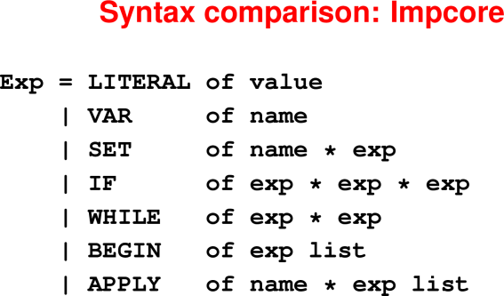
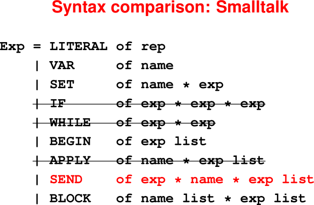

# Object Orientation. Inheritance. Dispatch. Predefined Classes.

Notes used with permission from https://www.cs.tufts.edu/comp/105/notes.html#april-2020-object-orientation
and from 
https://www.cs.tufts.edu/comp/105-2017f/notes.html#november-2017-object-orientation

April 20, 2020

## Announcements

 * HW9 is due Wednesday April 22
 * HW10 was posted last Friday and is due Wednesday April 29th


## Last Time

* Some questions about deriving type constraints (see piazza post)

* Intro to Object Oriented Programming

## Today

* Six questions about uSmalltalk

* Message passing

* Dynamic dispatch

* Predefined number classes


## Mechanisms review

* Message send replaces function application
* Receiver appears first: it's in charge
* Respond to message by evaluating method
* Method determined by an object's class
* A method can use primitive operations.


# Six questions about Smalltalk


## 1. **Values** are **objects** (even `true`, `3`, `"hello"`)

   Even classes are objects!

   There are **no functions**—only methods on objects


## 2. Syntax:

* Mutable variables

* Message send

* Sequential composition of mutations and message sends (side effects)

* "Blocks" (really closures, objects and closures in one, used as continuations)

* No `if` or `while`. These are implemented by passing continuations to Boolean 
  objects.
  (Smalltalk programmers have been indoctrinated and don't even notice)

<hr>

<hr>


<hr>

<hr>

<hr>

<hr>

### Message passing

Look at `SEND`

* Message identified **by name** (messages are not values)
* Always sent to a **receiver**
* Optional arguments must match **arity** of message name
  (no other static checking)
  
Note: `BLOCK` and `LITERAL` are special objects.

### Smalltalk syntax analysis

<hr>

<hr>

<hr>

<hr>

<hr>

<hr>

<hr>

<hr>

<hr>

<hr>

<hr>

<hr>


## 3. **Environments**

Name stands for a mutable cell containing an object:

 * Global variables
 * "Instance variables" (new idea, not yet defined)

## 4. **Types**

 * There is no compile-time type system.

 * At run time, Smalltalk uses behavioral subtyping, known to Rubyists as "duck 
   typing"

 * Note that subclassing and subtyping are not equivalent.  Think interfaces
   in Java.


## 5. **Dynamic semantics**

 * Main rule is **method dispatch** (complicated)
 * The rest is familiar


### Method dispatch

To answer a message:

* Consider the **class** of the **receiver**

* Is the method with that name defined?

* If so, use it

* If not, repeat with the **superclass**

Run out of superclasses?  "Message not understood"

### Class mechanisms

Superclass: Its methods can answer messages sent to me

Instance variables
* Parts from which I'm formed
* Visible only to me ("private")

Methods

* Activated whenever I receive a message

* By mechanism, "public" (anyone can send)

* By convention, some are private: Sent to myself, or to an instance I create

(Simplest thing that could possibly work.)


## 6. The **initial basis** is enormous

Why? To demonstrate the benefits of reuse, you need something big enough 
to reuse.  Also, EVERYTHING is an object including booleans and numbers.

### Class case study: Booleans

<hr>

<hr>

<hr>

<hr>

<hr>

<hr>


### Class case study: Magnitudes and numbers

* `Number` is a `Magnitude`

* `Integer` is a `Number`

* `SmallInteger` is an `Integer`

* Only `SmallInteger` is a concrete subclass.  The rest are all abstract.

<hr>

<hr>

### Each class has one of two roles

Abstract class

* Meant to be **inherited from**

* Some ( > 0) `subclassResponsibility` methods

* Examples: `Boolean`, `Shape`, `Collection`

Regular ("concrete") class

* Meant to be **instantiated**

* No `subclassResponsibility` methods

* Examples: `True`, `Triangle`, `List`


<hr>

<hr>


### Implementation of : Reuse

```
(class Magnitude            ; abstract class
    [subclass-of Object]
    (method =  (x) (self subclassResponsibility))
                    ; may not inherit = from Object
    (method <  (x) (self subclassResponsibility))
    (method >  (y) (y < self))
    (method <= (x) ((self > x) not))
    (method >= (x) ((self < x) not))
    (method min: (aMag)
       ((self < aMag) ifTrue:ifFalse: {self} {aMag}))
    (method max: (aMag)
       ((self > aMag) ifTrue:ifFalse: {self} {aMag}))
)
```

Note that methods in the abstract Magnitude class assume that `=` and `<`
have been defined in a subclass.  Here is an example of how `<` is implemented
in `SmallInteger` with uSmalltalk primitives.

From part of supplement not provided in printed Ramsey class notes:

<hr>

<hr>


# Summary of Key Ideas

## **Protocol** determines **behavioral subtyping**

* The protocol of an object is the set of messages it understands.

* Object A is a behavioral subtype of Object B if A understands all the messages 
  that B does in a compatible way.

* **Intuition**: If A is a behavioral subtype of B, then A can be used in any 
  context where B can be used.


## Class-based object-orientation

* Object implementations determined by its class definition.

* So, each class implicitly defines the protocol for its objects, and, dynamic dispatch is determined by object’s class.

* Code reuse by sending messages around like crazy.

## What's hard

* Encapsulation: abstraction function and invariant

* Higher-order programming: everything is higher order

* Dynamic dispatch: every call is to an unknown function (trust the contract)

* Inheritance: big vocabulary, hard to work one function in isolation

* Net effect: algorithms "smeared out" over many methods

## What's great

* Each method is super simple

* Cooperating-objects model

* Reuse, reuse, reuse

