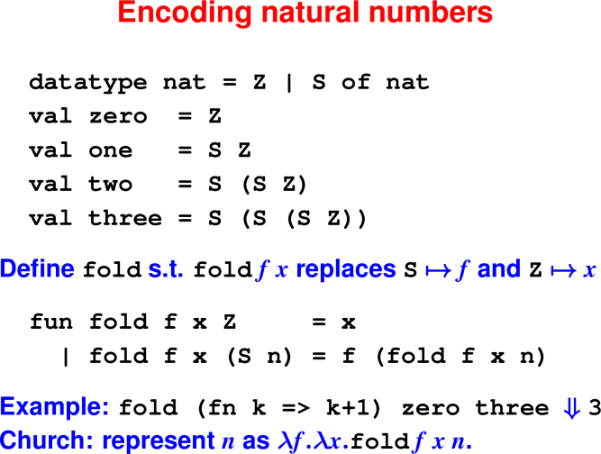
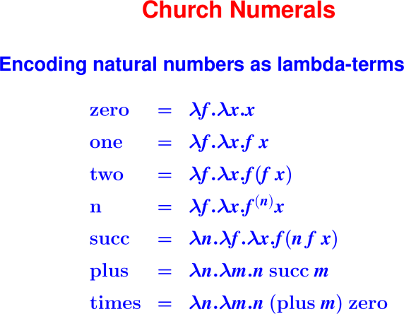
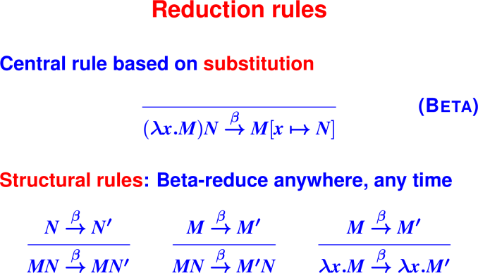
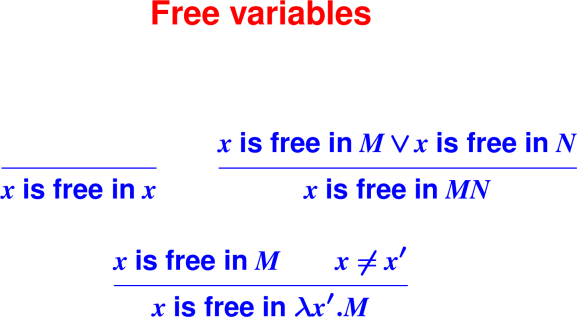
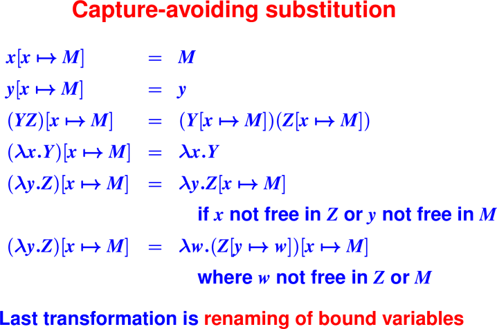
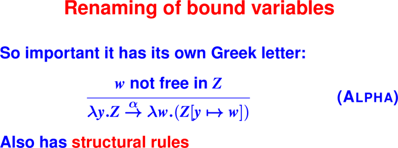

# Lambda Calculus

Notes used with permission from  https://www.cs.tufts.edu/comp/105-2019s/notes.html#april-2019-lambda-calculus
and from 
https://www.cs.tufts.edu/comp/105-2017f/notes.html#december-2017-lambda-calculus


April 22, 2020

## Announcements

 * HW9 is due tonight
 * HW10 was posted last Friday and is due Wednesday April 29th


## Last Time

* Six questions about uSmalltalk

* Message passing

* Dynamic dispatch

* Predefined number classes

## Today

* Lambda Calculus Overview

* Programming in the Lambda Calculus

* Operational Semantics


# Lambda Calculus


## What is a calculus?

Demonstration of differential calculus: reduce
```
d/dx (x + y)^2
```

Rules:
```
d/dx k = 0
d/dx x = 1
d/dx y = 0 where y is different from x
d/dx (u + v) = d/dx u + d/dx v
d/dx (u * v) = u * d/dx v + v * d/dx u
d/dx (e^n)   = n * e^(n-1) * d/dx e
```

So
```
d/dx (x + y)^22

2 ⋅ (x + y) ⋅ d/dx (x + y)

2 ⋅ (x + y) ⋅ (d/dxx + d/dxy)

2 ⋅ (x + y) ⋅ (1 + d/dxy)

2 ⋅ (x + y) ⋅ (1 + 0)

2 ⋅ (x + y) ⋅ 1

2 ⋅ (x + y)
```
What is a calculus? Manipulation of syntax.

What corresponds to evaluation? "Reduction to normal form"

## Why study lambda calculus?

* Theoretical underpinnings for most programming langauges (all in this class).

* Church-Turing Thesis: Any computable operator can be expressed as an encoding 
  in lambda calculus

* Test bench for new language features

## The world's simplest reasonable programming language

Just application, abstraction, and variables.
* Living without `let`, `while`
* Living without `if`
* Living without recursive `define`
* Coding data structures
* Coding natural numbers

Only three syntactic forms:
```
M ::= x | \x.M | M M'
```

Everything is **programming with functions**

* Everything is Curried

* Application associates to the left

* **Arguments are not evaluated**

First example:
```
(\x.\y.x) M N --> (\y.M) N --> M
```

Crucial: argument N is never evaluated (could have an infinite loop)

# Programming in Lambda Calculus

Everything is continuation-passing style

Q: Who remembers the boolean equation solver?

Q: What classes of results could it produce?

A: success, failure

Q: How were the results delivered?

A: calling continuations

Q: How shall we do Booleans?

A: true continuation, false continuation

Wait, a true continuation and false continuation, did we just see this
in uSmalltalk?  YES

## Coding Booleans

Booleans take two continuations:

```
 true  = \t.\f.t
 false = \t.\f.f
 
 // laws:
 if true  then N else P = N
 if false then N else P = P

 if = \b.\t.\e.b t e
```

Your turn: implement `not`

* Laws for `not`: what are the forms of the input data?

* Code for `not`

## Coding Pairs

* How many ways can pairs be created? (A: one, pair constructor)

* How many continuations? (A: one, corresponding to the pair)

* What information does it expect? (A: the two elements of the pair)

* What are the algebraic laws?

   * `fst (pair x y) = x`

   * `snd (pair x y) = y`

* Code `pair`, `fst`, and `snd`

```
pair x y f = f x y
fst p = p (\x.\y.x)
snd p = p (\x.\y.y)

pair = \x.\y.\f.f x y
fst  = \p.p (\x.\y.x)
snd  = \p.p (\x.\y.y)
```
FIXME: use some of Christian's slides to step through beta reductions?

## Coding Lists

* How many ways can lists be created? (A: two, nil and cons)

* How many continuations? (A: two, one for each)

* What does each continuation expect? (A: nil - nothing; cons - hd, tl)

* For each creator, what are the laws regarding its continuations?

```
cons y ys n c = c y ys
nil       n c = n

car xs = xs error (\y.\ys.y)
cdr xs = xs error (\y.\ys.ys)

null? xs = xs true (\y.\ys.false)


cons = \y.\ys.\n.\c.c y ys
nil  = \n.\c.n

car = \xs.xs error (\y.\ys.y)
cdr = \xs.xs error (\y.\ys.ys)

null? = \xs.xs true (\y.\ys.false)
```


## Coding numbers: Church Numerals

Wikipedia good: "Church numerals"

Key Idea: The value of a numeral is the number of times it applies its argument 
function.

<hr>

<hr>

<hr>

<hr>

## Church Numerals in λ

```
zero  = \f.\x.x;
succ  = \n.\f.\x.f (n f x);
plus  = \n.\m.n succ m;
times = \n.\m.n (plus m) zero;
 ...
-> four;
\f.\x.f (f (f (f x)))
-> three;
\f.\x.f (f (f x))
-> times four three;
\f.\x.f (f (f (f (f (f (f (f (f (f (f (f x)))))))))))
```

## Taking stock:

* bools

* pairs

* lists

* numbers

Question: **What’s missing from this picture?**

Answer: Recursive functions.

Astonishing fact: we don't need letrec or val-rec

The Y-combinator = `\f.(\x.f (x x))(\x.f (x x))` can encode recursion.

Will be covering the Y-combinator more on Monday.

# Operational semantics of lambda calculus

New kind of semantics: **small-step**

New judgment form
```
M --> N   ("M reduces to N in one step")
```
No context!! No turnstile!!
("turnstile" is the name for the |- symbol that separates the context
from the conclusion)

Just pushing terms around == calculus

<hr>

<hr>

## Beta-reduction

The substitution in the beta rule is the **heart of the lambda calculus**

* It's hard to get right
* It's a stupid design for real programming (shell, tex, tcl)
* It's even hard for theorists!
* But it's the simplest known thing


Examples:

1. Are these functions the same?
```
 \x.\y.x
 \w.\z.w
```

2. Are these functions the same?
```
 \x.\y.z
 \w.\z.z
```

<hr>

<hr>

Examples of free variables:
```
\x. + x y        (* y is free *)

\x.\y. x         (* nothing is free *)
```

## Exercise: Free Variables


What are the free variables in:
```
  \x.\y. y z
  \x.x (\y.x)
  \x.\y.\x.x y
  \x.\y.x (\z.y w)
  y (\x.z)
  (\x.\y.x y) y  
```
      
Exercise: Free Variables, answers

What are the free variables in:
```
  \x.\y. y z           - z
  \x.x (\y.x)          - nothing
  \x.\y.\x.x y         - nothing
  \x.\y.x (\z.y w)     - w
  y (\x.z)             - y z
  (\x.\y.x y) y        - y
```

<hr>

<hr>

Example:

```
(\yes.\no.yes)(\time.no) ->
\z.\time.no
```

and never
```
\no.\time.no    // WRONG!!!!!!
```

Must **rename the bound variable**:

```
(\yes.\no.yes) (\time.no) tuesday
   ->   
(\yes.\z.yes)  (\time.no) tuesday
   ->  
(\z.\time.no)  tuesday
   ->
\time.no
```

<hr>

<hr>


## Summary

* Lambda calculus is Turing Complete

* Essence of most programming languages

* Evaluation proceeds by substituting arguments for formal variables (called 
  beta reduction)

  * Definition of free variables

  * Alpha-conversion allows bound variables to be renamed.

