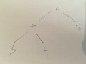

# Induction and Recursion Using an Imperative Core

CSc 520 Spring 2020 Assignment

* [Getting Started](#start)

* [Reading Comprehension](#read)

* [Programming in Impcore](#impcore)

* [What to submit and how to submit it](#submit)

* [How your work will be evaluated](#eval)


**Due Friday, January 24, 2020 at 11:59PM**

This first assignment is divided into two parts:
 * Comprehension questions that help you focus your reading
 * Programming exercises that reinforce your skills with induction and recursion

ALERT: This assignment is three or four times easier than a typical CSc 520 
assignment. Its role is to get you acclimated and to help you start thinking 
systematically about how recursion works. Later assignments get much harder and 
more time-consuming, so don’t use this one to gauge the difficulty of the 
course.


# Getting Started
<a name="start"/>

If you have `gcc`, `make`, `git`, `valgrind`, and potentially others installed
on your local machine, then you can skip the (docker) steps below and just
do everything on your own command line.

* create your github repository by accepting assignment invite,
  https://classroom.github.com/a/fvUBjrhT

* (docker) download and install docker desktop on your machine
  * https://www.docker.com/
  * You will have to create a docker hub id.

* (docker) download the docker image for this class and create a file
  * start docker desktop and use a terminal as it suggests
  * `docker pull mstrout/cs520spring2020` fetches the container from docker hub`
  * `docker run -it --rm --name cs520name -h cs520host mstrout/cs520spring2020`
    runs the container image interactively and should bring up a prompt
  * `appuser@cs520host:/cs520$ nano test.txt` edit a `test.txt` file in the 
     container
  * In another terminal window, copy the `test.txt` file to your host machine.
    `docker cp cs520name:cs520/test.txt .`

* within your running docker container or your own command line (**NOTE: you need 
  to replace yourgithubid below with your github id**):
  * clone your HW1 repository: `git clone https://github.com/UofA-CSc-520-Spring-2020/hw1-impcore-yourgithubid.git`

  * Create the impcore interpreter executable.
```
      cd hw1-impcore-yourgithubid/build-prove-compare/bare/impcore
      make
      cp impcore ../../../
      cd ../../../
      cp solution_template.imp solution.imp
      ./impcore -q < solution.imp
      // should list a bunch of function names and end with "The only test passed."
```
  * Edit README.md, solution.imp, and cqs.impcore.txt to complete HW1.

* Other NOTES
  * You can start the impcore REPL by typing `./impcore`.  Note that to send
    an end-of-file in the REPL and quit the REPL, use Ctrl-D.
  * git commit and push FREQUENTLY
  * You will be submitting README.md, solution.imp, and cqs.impcore.txt
    to Gradescope.
  * The docker container has the editors nano and vim installed.
  * `docker container prune` removes all stopped containers.
  * If you have any questions about this process ask **everyone** on
    Piazza.


# Reading-Comprehension Questions (10%)
<a name="read"/>

Please read pages 6–15, but not page 14, in the book by Ramsey. Then place the 
answers to the following questions in the text file called `cqs.impcore.txt` in 
your HW1-impcore repository:

1. What is the value of the following Impcore expression?

  `(if (> 3 5) 17 99)`


2. Which of the following best describes the syntactic structure of Impcore?

  a. An expression can contain a definition
  b. A definition can contain an expression
  c. Both of the above
  d. None of the above


3. Does this Impcore test pass? Please answer “yes” or “no.”

  `(check-expect (+ 1 2 3) 6)`

Assuming x is bound to a global variable, does this Impcore test pass? Again, 
please answer “yes” or “no.”

  `(check-expect (set x 1) 1)`


Next read Section 1.2, which starts on page 24, about abstract syntax.

4. After reading about abstract syntax, look at this picture of an 
   abstract-syntax tree for a "calculator expression":
  
  


Answer these questions:

a. What concrete syntax could you write in C for this expression (don't forget 
   operator precedence)?

b. What concrete syntax could you write in Impcore for this expression?


5. Read the expectations about contracts in the 
   [course coding guidelines](../coding-style.md#contract).

Suppose I write a contract for a power function that says, "this function 
multiplies x by itself n times." According to our expectations, is this a good 
contract or a bad contract? Please answer "good" or "bad."  If it is bad, write 
a good version.


# Programming in Impcore (90%)
<a name="impcore"/>

The problems below are simple programming exercises that serve multiple 
purposes:
 * to get you thinking explicitly about induction and recursion,
 
 * to get you acclimated to the LISP-style concrete syntax used throughout 
   the course,
 
 * to get you started with the course software, 
 
 * and to help you practice the forms of testing and documentation that are 
   expected in the course.
   
You can start these exercises immediately after the first lecture. If you 
find it entertaining, you may write very efficient solutions—but do not 
feel compelled to do so.

**Do not share your solutions with anyone.** We encourage you to discuss ideas, 
but **no one other than the instructor may see your code**.

## Using the software

If you are in the docker container and your code and unit tests are in file 
`solution.imp`, you can load and run them by typing

    ./impcore -q < solution.imp

## Unit testing

The special "extended-definition forms" `check-expect` and `check-error` 
are part of every language in the book. For example, as described in Section 
1.1.1 of the book, they are part of the Impcore language. These forms serve both 
as unit tests and as documentation. Every function you write must be tested and 
documented using check-expect, and possibly also `check-error`. The number of 
unit tests must be appropriate to the function's contract and to the structure 
of its input. In this first assignment, you should briefly explain the purpose 
of each `check-expect` definition, and you should explain why those 
`check-expects` are necessary and sufficient to test the code.

## Documentation

In addition to its unit tests, each function should be documented by a contract, 
which explains what the function does. Here’s an example:
```
;; (occurs-in? d n) returns 1 if and only if decimal digit `d`
;; occurs in the decimal representation of the positive integer
;; `n`; it returns 0 otherwise.
```
The [course coding guidelines](../coding-style.md#contract) explain contracts 
at length; read them. The contract is typically supplemented by unit tests, 
which can serve to clarify the contract:
```
(check-expect (occurs-in? 7 123) 0)
(check-expect (occurs-in? 2 123) 1)
```
For this assignment, I am also asking you to explain your inductive reasoning. 
Below each function, not as part of that function’s regular documentation, 
please put a comment that explains what inductive structure that function is 
imposing on the integers or the natural numbers. For example, I could write the 
`even? ` function this way:

```
;; (even? n) is given a natural number n; it returns 1 if n is
;; even and 0 otherwise
;;
(define even? (n)
  (if (= n 0) 1
    (if (= n 1) 0
        (even? (- n 2)))))

  ;; Breaks down the natural numbers into three cases:
  ;;    0
  ;;    1
  ;;    n+2, where n is a natural number
```

## A jumping-off point for your solution

You will put your solutions in a file solution.imp, and you will write an 
overview for the whole assignment in a README.md file. Templates for 
solution.imp and README.md are included when you create your github repository.

  * To turn the solution template into a real solution, follow these steps 
    for each function:

  * In a comment, you will find a template for the function’s contract. Edit the 
   contract to make it specific and accurate. Use the coding guidelines.

  * You will find one unit test that uses check-error. The test is a 
    placeholder. Remove the check-error and replace it with check-expect unit 
    tests, which you will write yourself. (You will need multiple unit tests: at 
    least one per base case and per induction step.)

  * You will find a function definition with the body (/ 1 0). Evaluating this 
    code divides 1 by 0, which causes an error. Replace this code with your 
    implementation of the function.

  * Below the function definition you will find a block comment containing a 
    placeholder for your analysis of the induction in the function. Replace the 
    placeholder with your actual analysis.

  * If you write any helper functions, supply each helper function with a 
    contract and with unit tests.

## The problems you must solve

Do Exercises 4, 5, 7, 8, and 10 on pages 79–82 of Ramsey’s textbook. Also do 
problem DD below.

DD. Function double-digit accepts a positive integer less than 20,000, and it 
returns a positive integer whose decimal representation is the same as the 
decimal representation of the input, except each digit appears twice. For 
example, (double-digit 123) is 112233. Implement double-digit.

These problems stress induction and recursion, which is the topic of the first 
class. A couple of them may still be challenging; if you have difficulty, come 
to office hours or ask questions on Piazza.

When doing HW1, I added 100 lines of code and documentation to 
solution_template.imp and the entire HW1 including reading took 4.5 hours.


## Expectations for your solutions

This assignment lays the foundations for much that is to come. Here’s what we 
expect:

  * Your solutions must be valid Impcore; in particular, they must pass the 
    following test:

        ./impcore -q < solution.imp > /dev/null

with no error messages and no unit-test failures. If your file produces error 
messages, we won't test your solution and you will earn No Credit for functional 
correctness (you can still earn credit for readability).

Your solutions must load and complete within 250 CPU milliseconds. If you write 
any long-running test, don't include them in `solution.imp`; instead, create a 
file `extra-tests.imp`.

On this assignment, as on several assignments to come, **you must use recursion**.  
Code using while loops will receive No Credit.

You may use helper functions where appropriate, but **you must not use global 
variables**.

Your code must be your own work. **Do not share your solutions with anyone. We 
encourage you to discuss ideas, but no one else may see your code**.


# What to submit and how to submit it
<a name="submit"/>

You will submit the following files from your github repository to Gradescope:

* `cqs.impcore.txt` will contain the comprehension questions and your answers

* `solution.imp` will contain your code, with its documentation and unit tests. 
  Problems will appear in order by number, with problem DD last.

* `README.md` will

  * Give your name and explain how to pronounce it, as in "kaeth-lEEn FI-shur"
    or "NORE-muhn RAM-zee" or "mih-shEHl strout". (www.pronouncenames.com)

  * Identify anyone with whom you have collaborated or discussed the assignment

  * Say approximately how many hours you have spent completing the assignment.

Keep submitting until your work is complete; we grade only the last submission.
**Each time you submit you have to submit ALL the files in gradescope.**

You may also submit `extra-tests.imp`, which should contain only test code and 
unit tests (check-expect or check-error). You can run the tests using the Unix 
command

    cat solution.imp extra-tests.imp | ./impcore -q


# How your work will be evaluated
<a name="eval"/>

## How your code will be evaluated
A big part of this assignment is for you to be sure you understand how we 
expect your code to be structured and organized. There is some material 
about this on the [coding style page](../coding-style.md) and the 
[coding rubric page](../coding-rubric.md). When we get 
your work, we will evaluate it in two ways:

* About 60% of your grade for the assignment will be based on our judgement 
  of the structure and organization of your code. To judge structure and 
  organization, we will use the following dimensions:

  * *Documentation* assesses whether your code is documented appropriately.

    We expect you to document each function such that someone else could use 
    your code and reason about its result without having to see the code itself. 
    In particular, every function must be documented with a contract, and the 
    contract must mention each parameter by name.

    For this assignment, we also expect you to document your analysis of the 
    inductive struture used by each function. Your analysis should explicitly 
    identify which cases are base cases and which are inductive steps.

    And remember that every named parameter should be mentioned in a function’s 
    contract.

  * *Unit testing* assesses whether your code is appropriately tested by 
    check-expect and/or check-error.

    We expect that you will write enough unit tests to test every part of your 
    code. And we expect a unit test for every base case and induction step in 
    your analysis of the inductive structure of numbers.

  * *Form* assesses whether your code uses indentation, line breaks, and 
    comments in a way that makes it easy for us to read.

    We expect you to use consistent indentation, to obey the offside rule 
    described in the coding-style guidelines, and to limit the use of inline 
    comments in the body of each function.

  * *Naming* assesses your choice of names. To help with program understanding, 
    names matter deeply.

    We give you a hand here by providing a template in which the names of 
    top-level functions and their arguments are already chosen for you. For 
    helper functions, you will choose your own names. Look at the 
    [coding rubric](../coding-rubric.md) and choose wisely.

  * *Structure* assesses the underlying structure of your solution, not just how 
    its elements are documented, formatted, and named.

    We expect that if asked to use recursion, your solution will use recursion. 
    Additionally, we expect that your recursive structure will be minimal, 
    avoiding superfluous cases—especially redundant base cases—and unnecessary 
    comparisons.

* About 30% of your grade for the assignment will be based on our judgement of  
  the correctness of your code. We often look at code to see if it is correct, 
  but our primary tool for assessing correctness is by testing. On a typical 
  assignment, the correctness of your code would carry more weight, but relative 
  to the other homeworks in 520, the problems on this assignment are easy, so 
  they carry less weight.

The detailed criteria we will use to assess your code are found in the 
[coding rubric](../coding-rubric.md). The coding rubric makes explicit what we 
mean by "good programming practice." But as you might imagine, there is a lot of 
information there—probably more than you can assimilate in one reading. The 
highlights are

* Documentation

  * Each function is documented with a contract that explains what the function 
    returns, in terms of the parameters, which are mentioned by name. From 
    documentation, it is easy to determine how each parameter affects the 
    result.
    
  * The contract makes it possible to use the function without looking at the 
    code in the body.
    
  * Documentation appears consistent with the code being described.
  
  * Each parameter is mentioned in the documentation at least once.
  
  * In every case analysis, all cases are necessary.

* Unit Testing

  * Unit tests cover the branches of execution for the function.

  * Unit tests test input which is valid per the problem definition.

* Form

  * Code fits in 80 columns.

  * Code respects the offside rule.

  * Code contains no tab characters.

  * Indentation is consistent everywhere.

  * If a construct spans multiple lines, its closing parenthesis appears at the 
    end of a line, possibly grouped with one or more other closing 
    parentheses—never on a line by itself.

  * No code is commented out.

  * Solutions load and run without calling print

* Naming

  * Each function is named either with a noun describing the result it returns, 
    or with a verb describing the action it does to its argument. (Or the 
    function is a predicate and is named as suggested below.)

  * A function that is used as a predicate (for if or while) has a name that is 
    formed by writing a property followed by a question mark. Examples might 
    include even? or prime?. (Applies only if the language permits question 
    marks in names.)

  * In a function definition, the name of each parameter is a noun saying what, 
    in the world of ideas, the parameter represents.

  * Or the name of a parameter is the name of an entity in the problem 
    statement, or a name from the underlying mathematics.

  * Or the name of a parameter is short and conventional. For example, a 
    magnitude or count might be n or m. An index might be i, j, or k. A pointer 
    might be p; a string might be s. A variable might be x; an expression might 
    be e.

* Structure

  * Solutions are recursive, as requested in the assignment.

  * There's only as much code as is needed to do the job.

  * In the body of a recursive function, the code that handles the base case(s) 
    appears before any recursive calls.

  * The code of each function is so clear that, with the help of the function’s 
    contract, course staff can easily tell whether the code is correct or 
    incorrect.
    
  * Expressions cannot be made any simpler by application of algebraic laws.
    In other words, expressions have been simplified (e.g., a + 2*b instead of 
    a + b + b).
